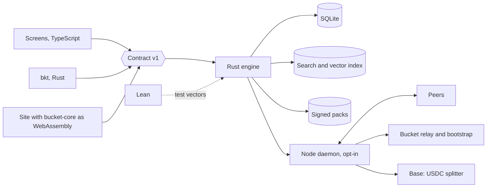

# Target Architecture

Bead `bkt-neoj`. Founder question: what is the full infrastructure and architecture of Bucket with the desktop app as the product.

Status: draft v2, 2026-10-01, revised after critic round 1 at 6.8, awaiting critic round 2 and founder decisions. `docs/ARCHITECTURE.md` describes what runs today. Every statement marked Proposed is a design, and nothing in it is built. Repo facts were read at `origin/dev`.

## First Decisions

Three decisions gate everything else. Each is the founder's.

1. Rust now, or after launch and Explore. The note on `bkt-6wjd` says no rewrite now, and the launch gate in `CLAUDE.md` gives agent time to launch screens alone. The Order of Work section proposes after.
2. The legal entity before any operator payout or contract deployment. `GOVERNANCE.md` line 5 says formalization is in progress and that the document is a statement of intent.
3. Who pays, given reading stays free, and whether the node share reduces the 80% author floor. `GOVERNANCE.md` line 64 states the default intent as 80% or more to authors and 20% or less to operations.

Founder decisions this design follows, 2026-10-01:

- Everything works on desktop, Linux first. The website delivers the download.
- The data engine for explore, search, canon and graphs is Rust.
- Lean belongs in the architecture.
- DePIN is an integral direction: the desktop app is the node.
- Payments settle in stablecoin.

## System Map

Proposed. The Language column is the target.

| Component | Language at target | Runs on | Talks to |
|---|---|---|---|
| Screens, `packages/bkt-ui` | TypeScript, React | Device webview | Engine contract only |
| Shell, `packages/bkt-desktop` | Rust, Tauri 2 | Device | Engine in-process, updater |
| Data engine | Rust | Device, with `bucket-core` and `bucket-pack` as WebAssembly in the browser | SQLite, index, packs |
| Terminal app `bkt` | Rust | Device | Engine in-process |
| Node daemon | Rust | Device, opt-in, off by default | Peers, relay, chain RPC |
| Local model | Third-party runtime | Device loopback | Engine |
| Lean specifications, `lean/` | Lean 4 | CI | Test vectors for Rust |
| Site | TypeScript, Next.js | Vercel | `bucket-core` as WebAssembly, release assets |
| Bootstrap, relay, pack mirror | Rust | Bucket server | Nodes |
| Language index, `hte-serve` | Python, Postgres | Bucket server | Engine, optional |
| Settlement | Solidity splitter contract | Base | Wallets, facilitator |

## Rust Data Engine

Today the engine is TypeScript: a Bun local server on 127.0.0.1 behind a session nonce (`packages/bkt/src/serve.ts`), `bun:sqlite` (`store.ts`), and ranking in `src/lib/canon-rank.ts`. `packages/bkt/src` holds 6,161 lines outside its tests.

Proposed crates:

| Crate | Holds | Builds for |
|---|---|---|
| `bucket-core` | Ranking, tier cap, FSRS, grading, address, payment split, receipt verification | Native and `wasm32` |
| `bucket-pack` | Pack format, hash, signature, rights filter | Native and `wasm32` |
| `bucket-store` | SQLite through rusqlite | Native |
| `bucket-index` | Full-text search and a vector index | Native |
| `bucket-engine` | The four operations | Native |
| `bucket-node`, `bucket-pay`, `bucket-wasm` | Node, settlement, browser bindings | As named |

One codebase for native and WebAssembly holds for `bucket-core` and `bucket-pack` alone. The store, the index, the engine and the node are native. The browser therefore gets ranking over an in-memory pack and pack verification. Full-text search over full corpora, the vector index, saved state and the node exist on the device only.

Storage. Proposed. SQLite keeps user data, sealed tables, graph edges and receipts. A search library such as tantivy adds ranked full-text search over the full corpora, and a vector index adds semantic search. The 6 MB canon pack needs neither. Both pay for themselves at 1.6 GB of corpora and the 6.5 million entry language index.

Contract v1. Proposed. Four operations: `search`, `open`, `neighbours` and `paths`, `save`. Each returns `{v:1,...}`. The window calls them as Tauri commands, the terminal as `--json` output, the browser as WebAssembly exports.

Order of the move, proposed:

1. Port ranking, with the golden fixtures from PR #511 as the oracle.
2. Pack reader.
3. Store, keyring, device key, under the Data Migration section.
4. FSRS and grading.
5. Remove the Bun sidecar.

Cost of the coupling. The packages import 30 distinct modules from the site's `src/`, counted from import statements under `packages/`:

| Group | Count | Modules |
|---|---|---|
| `src/lib/research-os` | 15 | `contract`, `db`, `launch-gate`, `launch-scope`, `advisor-review`, `productions-snapshot`, `primes-report`, `use-ros-resource`, four under `work-quiz/`, three JSON data files |
| `src/lib/academy` | 6 | `engine`, `fsrs`, `mastery`, `prereq-path`, `grip-sphere`, `bkt-serve-store` |
| `src/components/canon-globe` | 4 | `CanonGlobe`, `CanonMarkers`, `GlobeErrorBoundary`, `projections` |
| `src/components/research-os/views` | 3 | `PatentsView`, `SoftwareAtlas`, `SolvabilityAtlas` |
| `src/lib`, other | 2 | `canon-rank`, `canon-explorer/markers` |

By package: `bkt-ui` 17, `bkt` 11, `ros-contract` 9, `bkt-mobile` 1, `bkt-desktop` 0, with overlap between packages. `bkt-ui` aliases `@/`, `@ros` and `@academy` into `src`. Seven of the 30 are React components and stay TypeScript. The Rust move touches the two `src/lib` groups that hold logic: `canon-rank`, `academy/fsrs` at 104 lines, `academy/engine` at 341 lines, and the `work-quiz` grader. After the move the site loads `bucket-core` as WebAssembly, or it keeps a second copy of those modules.

## Lean

Today BucketMath is core Lean 4 with no Mathlib, and CI gates axioms and manifest drift (`bucketmath.yml`, `docs/agents/MATH-CONTRACT.md`). `lean/manifest.json` has 203 entries: 98 proved, 88 definitions, 16 `external` and 1 `open`. The 16 external entries are theorems whose source is another Lean tree in the repo, such as `papers/history-hypothesis-engine/lean`. `bucketmath.yml` triggers on that path. Whether the workflow builds those proofs was not confirmed in this review, so treat the 16 as listed and unchecked here. The open entry is `Bucket.Address.encode_injective`.

The targets have no code to prove yet. The repo holds no tier cap, no payment split and no log-scale grade, in Lean or in TypeScript, and no FSRS statement in Lean. The founding-work cap is a plan in `bkt-1fuf`. The shipped ranker is unverified today: `cosineRank` in `src/lib/canon-rank.ts` sums Float32 products and sorts on score alone, so equal scores keep index build order and no tie-break key exists.

Proposed order, specify then prove:

| Step | Work | Depends on |
|---|---|---|
| 1 | Write each rule as an executable Lean definition over integers or rationals: ranking order with a tie-break on record id, the tier cap, the payment split in integer micro-units | A founder decision on the split, and the cap from `bkt-1fuf` |
| 2 | Change the TypeScript ranker to the specified tie-break, and pin it with the PR #511 fixtures | Step 1 |
| 3 | Prove: ranking is a total order; the capped increase stays at or below the cap; split parts sum to the amount with the author share at 80% or more | Step 1 |
| 4 | Specify FSRS clamps and interval bounds over the rationals, then the grade, if a log-scale grade is adopted | A grade definition, which does not exist |
| 5 | Emit test vectors from the Lean definitions, and replay them in Rust property tests | Steps 1 to 4 and the Rust crates |

What the tie to Rust covers. Replaying Lean test vectors in Rust covers the vectors tested and nothing more. A proof holds for the Lean definition. The Rust function is a separate program, and agreement on a finite vector set is evidence for those inputs alone. Code extraction from Lean is out of scope.

CI, proposed: fail on an unproved statement outside the open list, on manifest drift, or on a vector mismatch.

`Bucket.Address.encode_injective` concerns the hypothesis address in the hypothesis engine. Bucket content addressing is SHA-256 (`PROTOCOL.md` section 3), and its collision resistance is an assumption.

Lean gives no assurance for floating-point behaviour, the search library, SQLite, cryptography, networking, or the splitter contract. Cosine scores stay Float32, so Lean covers the ordering rule over given scores and says nothing about the scores. Ranking quality is the job of the Explore evaluation set in `bkt-1fuf`.

## Data Migration

Today. `bkt.db` is a plain SQLite file in the user's data directory (`setup.ts`), with sealing per column. The scheme in `packages/bkt/src/crypto.ts`:

| Part | Value |
|---|---|
| Cipher | AES-256-GCM, 12-byte random IV, 16-byte tag |
| Stored form | `v1:` then base64 of IV, tag, ciphertext |
| Associated data | A per-row string such as `attempt:<id>`, `note:<id>`, `hai:<id>`, `daily_quiz:<day>` |
| Data key | 32 random bytes, hex, in the OS keyring under service `bucket-bkt`, account `db-data-key` |
| Keyring kinds | libsecret, keychain, DPAPI, and a passphrase file |
| Passphrase fallback | scrypt with N 2^17, r 8, p 1, a 16-byte salt, NFKC-normalised input, wrapping entries in `keyring.json` beside the database |
| Key check | `meta.key_check` seals the string `bkt`; a mismatch refuses to open |
| Schema version | `pragma user_version` |

Sealed columns sit in `attempts`, `outbox`, `hai_answer`, `notes`, `history_snapshot`, `daily_quiz`, `advisor_review`, `advisor_rows` and `work_quiz_source`. The data key is random, so no passphrase derives it on a system keyring. Today a lost keyring entry means the sealed columns are unreadable, and `bkt` refuses to make a new key over an existing database (`KeyringLockedError`). No recovery path exists.

Proposed controls, all before phase 3:

| Control | Design |
|---|---|
| Read compatibility | A fixture database written by the TypeScript store at every `user_version`, committed with a test key. The Rust store opens it and returns every sealed row byte-equal. The test gates CI from the first `bucket-store` commit |
| Format freeze | Rust reads and writes `v1:` unchanged, with the same associated-data strings. A new format is a later change with its own version prefix |
| Backup | Before the Rust store first opens a database, the app copies `bkt.db` and `keyring.json` where present to a dated sibling file and verifies the copy opens |
| Dual read | Through phase 2 the Bun store stays the writer. Rust opens the file read-only |
| Rollback | Until phase 3 the previous release opens the same file, since the format and `user_version` are unchanged. After a Rust schema change, rollback means restoring the dated backup, and work since the backup is lost |
| Key loss | An encrypted export of the data key under a user passphrase, using the existing scrypt parameters, offered at first run. Without it a lost keyring entry stays unrecoverable. Bucket holds no key |

Phase 3 is the point of no return. It becomes one when the Rust store first bumps `user_version`, since the TypeScript store cannot open a newer schema. Until then three things keep the move reversible: the unchanged `v1:` format, the unchanged schema version, and Bun as the single writer.

## Desktop as a Node

All of this is proposed. Parts drawn from general knowledge of peer-to-peer networks are marked.

A node contributes four things: it seeds signed packs, answers queries from its index, verifies receipts, and runs the local model for its owner alone.

| Concern | Design |
|---|---|
| Discovery | A distributed hash table, seeded by a Bucket bootstrap server. General knowledge |
| Routing | A query goes to several nodes that hold the pack hash |
| Wrong answers | Answers carry record hashes checked against the signed pack manifest. Ranking is deterministic over a given pack, so a second node recomputes and compares |
| Withheld answers | Recomputation cannot catch a node that withholds an index or omits records. The device asks several nodes and compares result sets against the manifest's record count, and it ranks the canon pack locally. If every node asked colludes, the omission goes unseen |
| Stays on the device | Local-only tables, chat stubs, notes, attempts, keys |
| Earnings | A share of settled citation fees, under the rules in Sybil Resistance |

Hard parts:

| Problem | Position |
|---|---|
| Restricted text | Nodes serve packs whose manifest licences permit redistribution. The rights filter stays a build gate |
| Nodes behind NAT | Relay plus hole-punching, with the relay as a Bucket cost. General knowledge |
| Abuse | Rate limits, signed packs alone, no arbitrary uploads |
| Legal | See Open Legal Questions |

Conflict with the protocol. `PROTOCOL.md` section 3.1 forbids a payment challenge on a caller-facing read path. Paid queries therefore mean settlement by a downstream publisher who cites, and reading stays free.

### Sybil Resistance

Version 1 said pay on payer-funded receipts and self-dealing costs the payer. That fails three ways:

- Reading is free, so a read has no payer. A node earns nothing for reads, and serving volume cannot be the basis of pay.
- A payer can wash trade with its own node. A publisher who cites anyway routes the citation through a node it runs and takes the node share back as a rebate.
- The splitter pays whoever the payer names, so the payer picks the node.

Proposed rules:

| Rule | Effect |
|---|---|
| Node pay comes from the citation fee alone, with no reward funded from outside it | A wash trade returns less than it spends, by the author and foundation shares |
| The node is named by a serving receipt the node signed before payment, bound to the record hash and a request nonce | The payer cannot name a node after the fact |
| Node pay needs a payer unrelated to the node: a different wallet, no funding path between them inside a set window, and no shared operator registration | Removes the direct rebate |
| Per-payer cap: one payer contributes at most a set fraction of a node's pay per period | Bounds what one colluding payer moves |
| Payment floor: a citation below a set amount pays no node share | Removes dust farming |

Unsolved. On a permissionless chain a new wallet costs nothing, so "unrelated" is a heuristic that a patient operator defeats with fresh wallets and an outside funding path. Two colluding parties pass every rule above. The caps bound the loss and do not remove it. Proof that a node served a reader who never pays does not exist in this design. A registry of known operators would close the gap and would end permissionless entry, and that trade is a founder decision.

### Home Serving

Proposed. The node is opt-in and off by default. Turning it on is a settings action with the items below shown first.

| Topic | Position |
|---|---|
| Legal exposure | The operator's machine distributes third-party text from a home address. A licence error in a pack becomes the operator's distribution. Whether a home operator has any safe-harbour protection is an open legal question |
| Takedown notices | A notice reaches Bucket for the pack and may reach the operator's internet provider for the address. Proposed: a signed revocation list that nodes fetch and obey, a published contact for notices, and removal from every node on the next fetch. No process exists today |
| Open ports | The default is outbound connections through the relay with no inbound port. Direct inbound serving is a second opt-in |
| Bandwidth | A user-set cap on upload rate and monthly volume, with seeding paused on metered connections |
| Exposure of the address | Peers and the relay see the operator's IP address. The settings screen says so |
| Content served | Signed packs with redistribution licences alone. Nothing from local-only tables leaves the device |

`bkt-12f3` is open: the repo and the live site carry Kruse text without recorded permission. No node serves a pack until that bead is resolved.

## Stablecoin Settlement

Today nothing settles: `signX402ServerSide` returns null without a wallet key in `src/lib/x402-pay.ts`. `MANIFESTO.md` line 41 says reader-side settlement is live. The two files disagree and one needs correcting.

Proposed flow for one paid citation:

1. A publisher's wallet signs one EIP-3009 `transferWithAuthorization` in USDC on Base.
2. The payee is a splitter contract, which divides the amount between author, node and foundation.
3. A receipt is written: transaction hash, record SHA-256, node signature.

| Topic | Design |
|---|---|
| Split | Governance sets 80% or more to authors and 20% or less to operations. Whether the node share comes out of the 20% is First Decision 3 |
| Keys | The wallet key sits in the OS keyring, separate from the Ed25519 device key |
| Offline | Signatures and pack membership verify offline. Finality needs a chain read. With no network, authorisations queue until their `validBefore` time |

Undecided about the splitter contract and the rail:

| Item | Open |
|---|---|
| Deployer | Which entity or person deploys. A personal deployment before the nonprofit exists makes the founder the counterparty |
| Upgrade authority | Immutable, or upgradeable, and by which key or multisig |
| Pause key | Whether a pause exists, who holds it, and what happens to funds in flight |
| Facilitator | Who submits the authorisation and pays gas: Bucket, a third party, or the payer |
| Authors with no wallet | Most canon authors have none, and many are dead. Holding their share is custody. Options are escrow in the contract, a named charity, or no fee for that record |
| Audit | No audit is scoped or priced |

## Infrastructure

Today a `bkt-v*` tag builds five targets, signs with the release key, verifies installs and promotes (`bkt.yml`). Tauri builds deb, AppImage, dmg and msi with the updater key (`bkt-desktop.yml`).

| Area | Proposed |
|---|---|
| Build | A cargo workspace on the same target matrix, with reproducible builds |
| Servers | The site, one bootstrap and relay host, the existing language-index host |
| Identity | The device key today, a wallet key added |
| Observability | Local logs and `bkt doctor`. Export is started by the user |
| Backups | The dated copy and the key export in Data Migration. Bucket holds nothing |

### Pack Updates

Proposed. A pack is signed with the release key, content-addressed, and updated independently of the binary. Mirrors are GitHub Releases and nodes.

| Step | Design |
|---|---|
| Fetch | The app reads a signed manifest naming the current pack hash per pack id |
| Verify | Hash, signature and rights filter pass before the new pack is used |
| Swap | The new pack lands beside the old one, and the pointer moves after verification |
| Rollback | The previous pack stays on disk for one release. A failed open or a revocation moves the pointer back |
| Revocation | The signed revocation list from Home Serving removes a pack from use and from seeding |
| Saved references | A saved item stores the record hash, so it resolves across pack versions or shows as withdrawn |

## Trust Boundaries

| Boundary | What crosses | Control | State |
|---|---|---|---|
| Window to engine | Contract calls | Tauri capabilities, content policy `'self'` | Today |
| Deep link to shell | `bucket://` | Route allowlist | Today |
| Release to device | Binaries, packs | Signature and checksum, plus a pack signature | Binaries today, packs proposed |
| Peer to node | Queries, answers | Signed packs, recompute, several nodes asked, rate limit | Proposed |
| Device to chain | Authorisations | Signed by the user, amount-capped | Proposed |
| Local files to engine | Chat logs | Fixed roots, secret scan, off by default | Today |
| Corpus to pack | Third-party text | Rights denylist, the build fails on a match | PR #515 |
| Old store to new store | `bkt.db`, data key | Read-compatibility test, dated backup | Proposed |

## Learning System and Research OS

Today Learn runs in the Bun sidecar on `src/lib/academy/fsrs.ts` and `engine.ts`, with decks in the `learn_*` tables of `bkt.db`. Research OS views in `bkt-ui` import `@ros/contract`, `advisor-review`, `productions-snapshot` and the `work-quiz` modules from the site. Hypothesis generation is `hte-serve`, Python on loopback.

Proposed:

| Part | Target |
|---|---|
| FSRS scheduling, mastery, prerequisite path | `bucket-core`, with the TypeScript versions as the oracle until phase 3 |
| Work-quiz grading | `bucket-core`. Question generation calls the local model and stays outside the core |
| Research OS records, notes, advisor review | `bucket-store` tables behind `open` and `save` |
| Research OS views | TypeScript in `bkt-ui`, reading through the contract |
| Hypothesis engine | Stays Python behind its HTTP seam. A Rust port is out of scope |

Contract v1 has four operations and none covers a review session or a quiz attempt. Learn needs either a fifth operation or a second contract, and that choice is open.

## Mobile

Today `packages/bkt-mobile` is a Capacitor shell with `android` and `ios` projects, importing one site module. It has no engine.

Proposed. `bucket-core` and `bucket-pack` compile for mobile as WebAssembly inside the webview, which gives ranking over the canon pack and Learn scheduling. A native mobile engine with SQLite is a later choice between Tauri mobile and Rust bindings into the Capacitor shell. A phone is never a node: battery, metered data and background limits rule it out. Mobile is outside phases 0 to 5.

## Accessibility

Today 9 files under `packages/bkt-ui/src` carry ARIA attributes or an accessibility reference. No automated check gates the window, and the globe view has no keyboard path verified in this review.

Proposed. The screens stay TypeScript, so the engine move changes no accessibility behaviour. Targets for the window: every view reachable by keyboard, a list alternative to the globe, an automated axe run on each view in CI, and a manual screen-reader pass with Orca on Linux before a release claims support. The terminal app honours `NO_COLOR` and non-TTY output under `bkt-qkcp`.

## Measurement of User Impact

The founder's stated priority in `bkt-1fuf` is impact on the tasks users bring. The audit there found Explore completing none of four tasks across nine live queries, and no query, click or outcome event in the Explore code. A Rust engine changes none of that by itself.

Measures, with the engine held to them:

| Measure | Source | State |
|---|---|---|
| Tasks finished: primary source found, field mapped, person found, open question found | The `bkt-1fuf` evaluation set, 40 development and 20 held-out queries with a committed hash | Planned in `bkt-1fuf` |
| Top-3 rate on tasks 1 and 2, bar 80% | Same set | Planned |
| Saved results per session | Local event counts, exported by the user alone | Proposed |
| Human and AI performance, solo against paired | The probe in `packages/bkt/src/hai`: 20 pairs per probe, a 7-day retest, stored in `hai_probe` and `hai_answer` | Built |
| Retention on Learn | FSRS review outcomes in `learn_*` tables | Built, unreported |

Gate, proposed: each migration phase reruns the evaluation set and the ranking fixtures, and a phase that lowers a task measure does not ship. The probe measures whether a person does better with the tool than alone, and it is the closest thing in the repo to an impact measure. Nothing measures impact outside a session, and telemetry stays local unless the user exports it.

## Costs

Estimates from general knowledge unless a source is named. None is a quote.

| Item | Estimate |
|---|---|
| Rust port of the engine | 6,161 TypeScript lines in `packages/bkt/src` plus about 550 in `canon-rank`, `fsrs` and `academy/engine`. Months of agent and review time, with no measured rate behind that figure |
| Two engines during phases 1 and 2 | Every ranking change lands twice until Bun is removed |
| Bootstrap and relay host | Tens of dollars a month at first. Relay bandwidth grows with nodes behind NAT and is unbounded without a cap |
| Contract audit | Unpriced. Required before mainnet in this design |
| Legal counsel for the questions below | Unpriced |
| Gas on Base per settlement | Cents or less per transfer at current fees, paid by whoever runs the facilitator |
| Binary size | Unmeasured. Spike S1 records it |

## Order of Work

Proposed, and subject to First Decision 1.

| Order | Work | Why here |
|---|---|---|
| 1 | Launch gate in `CLAUDE.md` | A bead is ready only when it names a screen or API a user touches at launch. This architecture names none, so `bkt-neoj` carries `post-launch` until the gate opens |
| 2 | `bkt-1fuf` Explore | The impact measure, the evaluation set and the ranking rule come from here. Porting a ranker that finishes no task ports the failure |
| 3 | `bkt-6wjd` parity, in TypeScript | Its design freezes the contract and the golden fixtures, which is phase 0 here. Its note says no rewrite now |
| 4 | Spike S1 | Two days, no product code |
| 5 | Phases 1 to 3 | Rust behind the frozen contract |
| 6 | Phases 4 and 5 | After First Decisions 2 and 3 and the legal questions |

Lean step 1, the written specification, costs little and can run beside `bkt-1fuf`, since the tier cap is defined there.

## Migration

Each phase ships a working app. All proposed.

### Spike S1: WebAssembly in the Compiled Sidecar

Phase 1 assumes a wasm module loads inside the `bun build --compile` binary that `packages/bkt/package.json` builds. The repo has no wasm file and no test of this.

| Question | Measure |
|---|---|
| Does a `wasm32` build of a ranking function load and run in the compiled binary on all five release targets | Pass or fail per target |
| Size | Bytes added to `dist/bkt` |
| Cold start | Milliseconds from process start to first ranked result, against the TypeScript ranker |
| Parity | The PR #511 fixtures pass through the wasm path |

If S1 fails on any target, phase 1 changes: the native engine of phase 2 comes first, in the Tauri shell, and Bun calls it over the loopback contract. The standalone `bkt` terminal binary keeps TypeScript ranking until phase 3. The site still loads `bucket-core` as WebAssembly in the browser, which S1 does not test.

| Phase | Change | Reversible |
|---|---|---|
| 0 | Freeze contract v1 and the golden fixtures in TypeScript | Yes |
| S1 | The spike above | Yes, no product code |
| 1 | `bucket-core` as WebAssembly inside the Bun sidecar and the site, or the fallback above | Yes, a flag selects the TypeScript ranker |
| 2 | Native engine in the Tauri shell, reading `bkt.db` read-only. Bun keeps Learn, jobs and all writes | Yes |
| 3 | Store, keys and FSRS move. Bun removed. `bkt` in Rust | No, after the first schema bump. Restore from the dated backup |
| 4 | Node and receipts on a test network, node off by default | Yes, the node is a separate opt-in |
| 5 | Mainnet settlement, full corpora | No, for a deployed immutable contract |

Kept as built: the pack format and rights filter from PR #515, the Explore ranking as specification and oracle, the notifier in PR #514, the keyring guard in PR #516, and the terminal command table, JSON shapes and exit codes from `bkt-qkcp`.

Replaced: the full-text loading in `packages/bkt/src/canon.ts`, the Ink terminal app, the `bun:sqlite` store.

## Open Legal Questions

Bucket is a nonprofit in formation, held in the founder's personal capacity (`GOVERNANCE.md`). These are questions for counsel. This document gives no answer to any of them.

1. Sanctions screening: does a party that deploys or operates the splitter, or runs the facilitator, have a duty to screen payers, authors and operators, and against which lists?
2. Money transmission: does routing a payer's USDC to authors and operators through a contract Bucket deployed, or through a facilitator Bucket runs, make Bucket a money transmitter in any state or country it touches?
3. Operator payouts: does a nonprofit paying node operators raise private-benefit, employment or reporting duties, and what does an operator owe in tax?
4. Holding USDC: may the entity hold stablecoin, including unclaimed author shares, and under what accounting and custody rules?
5. Ownership of the contract: who owns and answers for a contract deployed before the entity exists, and can ownership pass to the entity later?
6. Home serving: what exposure does an operator carry for distributing third-party text, and what does Bucket carry for directing it?
7. Jurisdiction: which one governs the entity, the contract and operators abroad?

## Open Items

The design leaves these unsolved: ranking quality, proof of service for free reads, collusion between two parties, author wallet onboarding, key recovery for users who skip the export, the public-history question in `bkt-12f3`, and a native mobile engine.

Founder decisions after the first three:

4. Who holds unclaimed author fees?
5. Is Mathlib allowed, to close `encode_injective`?
6. Who signs the Explore evaluation set in `bkt-1fuf`?
7. Does Learn get a fifth contract operation or its own contract?
8. Is a registry of known operators acceptable, at the cost of permissionless entry?
