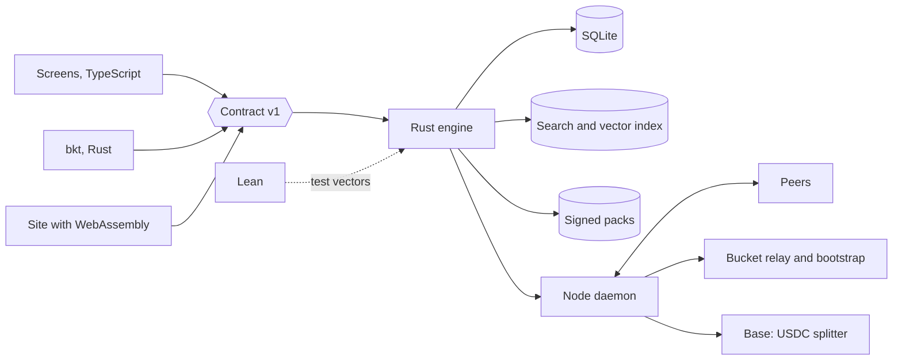

# Target Architecture

Bead `bkt-neoj`. Founder question: what is the full infrastructure and architecture of Bucket with the desktop app as the product.

Status: draft v1, 2026-10-01, awaiting critic review and founder decisions. `docs/ARCHITECTURE.md` describes what runs today. Every row marked Proposed is a design, and nothing in it is built.

Founder decisions this design follows, 2026-10-01:

- Everything works on desktop, Linux first. The website delivers the download.
- The data engine for explore, search, canon and graphs is Rust.
- Lean belongs in the architecture.
- DePIN is an integral direction: the desktop app is the node.
- Payments settle in stablecoin.

## System Map

| Component | Language at target | Runs on | Talks to |
|---|---|---|---|
| Screens, `packages/bkt-ui` | TypeScript, React | Device webview | Engine contract only |
| Shell, `packages/bkt-desktop` | Rust, Tauri 2 | Device | Engine in-process, updater |
| Data engine | Rust | Device, and WebAssembly in the browser | SQLite, index, packs |
| Terminal app `bkt` | Rust | Device | Engine in-process |
| Node daemon | Rust | Device, opt-in | Peers, relay, chain RPC |
| Local model | Third-party runtime | Device loopback | Engine |
| Lean specifications, `lean/` | Lean 4 | CI | Test vectors for Rust |
| Site | TypeScript, Next.js | Vercel | Engine as WebAssembly, release assets |
| Bootstrap, relay, pack mirror | Rust | Bucket server | Nodes |
| Language index, `hte-serve` | Python, Postgres | Bucket server | Engine, optional |
| Settlement | Solidity splitter contract | Base | Wallets, facilitator |

## Rust Data Engine

Today the engine is TypeScript: a Bun local server on 127.0.0.1 behind a session nonce (`packages/bkt/src/serve.ts`), `bun:sqlite` (`store.ts`), and ranking in `src/lib/canon-rank.ts`.

Proposed crates:

| Crate | Holds | Builds for |
|---|---|---|
| `bucket-core` | Ranking, tier cap, FSRS, grading, address, payment split, receipt verification | Native and `wasm32` |
| `bucket-pack` | Pack format, hash, signature, rights filter | Native and `wasm32` |
| `bucket-store` | SQLite through rusqlite | Native |
| `bucket-index` | Full-text search and a vector index | Native |
| `bucket-engine` | The four operations | Native |
| `bucket-node`, `bucket-pay`, `bucket-wasm` | Node, settlement, browser bindings | As named |

Storage. SQLite keeps user data, sealed tables, graph edges and receipts. A search library such as tantivy adds ranked full-text search over the full corpora, and a vector index adds semantic search. The 6 MB canon pack needs neither. Both pay for themselves at 1.6 GB of corpora and the 6.5 million entry language index.

Contract v1. Four operations: `search`, `open`, `neighbours` and `paths`, `save`. Each returns `{v:1,...}`. The window calls them as Tauri commands, the terminal as `--json` output, the browser as WebAssembly exports. In the browser `bucket-core` ranks an in-memory pack, since tantivy and rusqlite are native libraries.

Order of the move:

1. Port ranking, with the golden fixtures from PR #511 as the oracle.
2. Pack reader.
3. Store, keyring, device key.
4. FSRS and grading.
5. Remove the Bun sidecar.

Cost. The desktop packages import 11 `src/lib` modules from the site today, and `bkt-ui` aliases `@/`, `@ros` and `@academy` into `src`. After the move the site loads the engine as WebAssembly, or it keeps a second copy of `fsrs.ts` and `academy/engine.ts`.

## Lean

Today BucketMath is core Lean 4 with no Mathlib, and CI gates axioms and manifest drift (`bucketmath.yml`, `docs/agents/MATH-CONTRACT.md`).

Worth proving:

- Ranking is a total order with a deterministic tie-break.
- The founding-work score increase stays at or below its cap.
- Payment split parts sum to the amount in integer micro-units, with the author share at 80% or more.
- FSRS clamps and interval bounds, over the rationals.
- The log-scale grade is symmetric and monotone in the ratio.

Open today. `Bucket.Address.encode_injective` is unproved, listed as open in `manifest.json`. It concerns the hypothesis address in the hypothesis engine. Bucket content addressing is SHA-256 (`PROTOCOL.md` section 3), and its collision resistance is an assumption.

Tie to Rust. Each Lean definition is executable and emits test vectors. Rust property tests replay them. CI fails on an unproved statement outside the open list, on manifest drift, or on a vector mismatch. Code extraction from Lean is out of scope.

Lean gives no assurance for floating-point behaviour, the search library, SQLite, cryptography, networking, or the splitter contract. Ranking quality is the job of the Explore evaluation set in `bkt-1fuf`.

## Desktop as a Node

All of this is proposed. Parts drawn from general knowledge of peer-to-peer networks are marked.

A node contributes four things: it seeds signed packs, answers queries from its index, verifies receipts, and runs the local model for its owner alone.

| Concern | Design |
|---|---|
| Discovery | A distributed hash table, seeded by a Bucket bootstrap server. General knowledge. |
| Routing | A query goes to several nodes that hold the pack hash |
| Verification | Answers carry record hashes checked against the signed pack manifest. Ranking is deterministic, so a second node recomputes and compares |
| Stays on the device | Local-only tables, chat stubs, notes, attempts, keys |
| Earnings | A share of settled citation fees for answers served |

Hard parts:

| Problem | Position |
|---|---|
| Fake nodes | Pay on settled, payer-funded receipts alone. Uptime earns nothing, so self-dealing costs the payer money |
| Restricted text | Nodes serve packs whose manifest licences permit redistribution. The rights filter stays a build gate |
| Nodes behind NAT | Relay plus hole-punching, with the relay as a Bucket cost. General knowledge |
| Abuse | Rate limits, signed packs alone, no arbitrary uploads |
| Legal | A nonprofit paying operators raises private-benefit, reporting and money-transmission questions. The repo holds no answer: `GOVERNANCE.md` says formalization is in progress |

Conflict with the protocol. `PROTOCOL.md` section 3.1 forbids a payment challenge on a caller-facing read path. Paid queries therefore mean settlement by a downstream publisher who cites, and reading stays free.

## Stablecoin Settlement

Today nothing settles: `signX402ServerSide` returns null in `src/lib/x402-pay.ts`. `MANIFESTO.md` line 41 says reader-side settlement is live. The two files disagree and one needs correcting.

Proposed flow for one paid citation:

1. A publisher's wallet signs one EIP-3009 `transferWithAuthorization` in USDC on Base.
2. The payee is a splitter contract, which divides the amount between author, node and foundation.
3. A receipt is written: transaction hash, record SHA-256, node signature.

| Topic | Design |
|---|---|
| Split | Governance sets 80% or more to authors and 20% or less to operations. The node share comes out of the 20% unless governance changes it |
| Keys | The wallet key sits in the OS keyring, separate from the Ed25519 device key |
| Offline | Signatures and pack membership verify offline. Finality needs a chain read. With no network, authorisations queue until their `validBefore` time |

Open questions: fees for authors with no wallet, which is custody; sanctions screening; tax reporting for operators; who runs the facilitator.

## Infrastructure

Today a `bkt-v*` tag builds five targets, signs with the release key, verifies installs and promotes (`bkt.yml`). Tauri builds deb, AppImage, dmg and msi with the updater key (`bkt-desktop.yml`).

| Area | Proposed |
|---|---|
| Build | A cargo workspace on the same target matrix, with reproducible builds |
| Packs | Signed with the release key, content-addressed, updated independently of the binary, mirrored on GitHub Releases and by nodes |
| Servers | The site, one bootstrap and relay host, the existing language-index host. Tens of dollars a month at first, an estimate from general knowledge |
| Identity | The device key today, a wallet key added |
| Observability | Local logs and `bkt doctor`. Export is started by the user |
| Backups | An encrypted export the user holds. Bucket holds nothing |

## Trust Boundaries

| Boundary | What crosses | Control | State |
|---|---|---|---|
| Window to engine | Contract calls | Tauri capabilities, content policy `'self'` | Today |
| Deep link to shell | `bucket://` | Route allowlist | Today |
| Release to device | Binaries, packs | Signature and checksum, plus a pack signature | Binaries today, packs proposed |
| Peer to node | Queries, answers | Signed packs, recompute, rate limit | Proposed |
| Device to chain | Authorisations | Signed by the user, amount-capped | Proposed |
| Local files to engine | Chat logs | Fixed roots, secret scan, off by default | Today |
| Corpus to pack | Third-party text | Rights denylist, the build fails on a match | PR #515 |

## Migration

Each phase ships a working app.

| Phase | Change |
|---|---|
| 0 | Freeze contract v1 and the golden fixtures in TypeScript |
| 1 | `bucket-core` as WebAssembly inside the Bun sidecar and the site |
| 2 | Native engine in the Tauri shell. Bun keeps Learn and jobs |
| 3 | Store, keys and FSRS move. Bun removed. `bkt` in Rust |
| 4 | Node and receipts on a test network |
| 5 | Mainnet settlement, full corpora |

Kept as built: the pack format and rights filter from PR #515, the Explore ranking as specification and oracle, the notifier in PR #514, the keyring guard in PR #516, and the terminal command table, JSON shapes and exit codes from `bkt-qkcp`.

Replaced: the full-text loading in `packages/bkt/src/canon.ts`, the Ink terminal app, the `bun:sqlite` store.

## Open Items

The design leaves four things unsolved: ranking quality, author wallet onboarding, the public-history question in `bkt-12f3`, and mobile.

Founder decisions:

1. Does the Rust work start now? The note on `bkt-6wjd` says no rewrite now.
2. Does a node share reduce the 80% author floor or the 20% operations cap?
3. Who pays: downstream publishers alone, as `PROTOCOL.md` section 3.1 implies?
4. Which legal entity and jurisdiction come before any operator payout?
5. Who holds unclaimed author fees?
6. Is Mathlib allowed, to close `encode_injective`?
7. Who signs the Explore evaluation set in `bkt-1fuf`?
