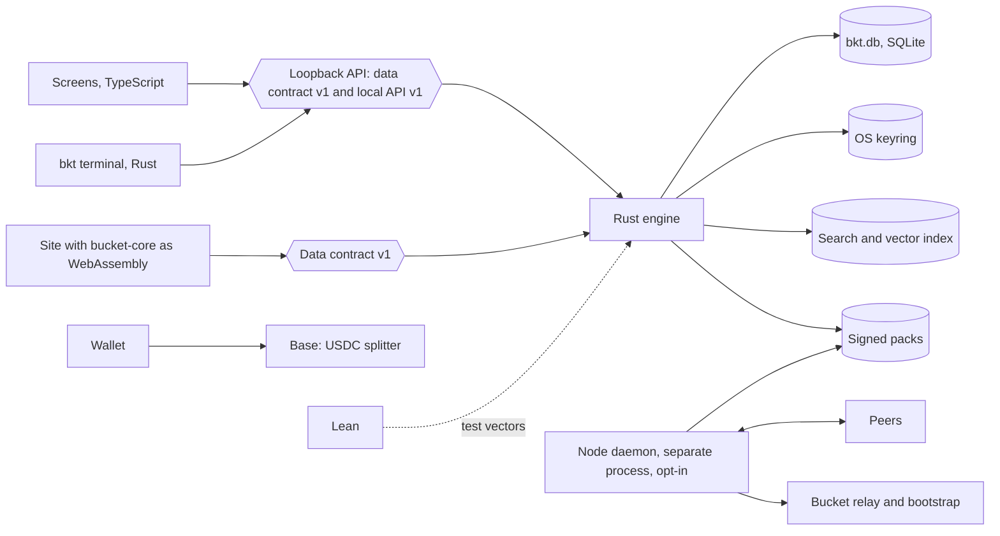

# Target Architecture

Bead `bkt-neoj`. Founder question: what is the full infrastructure and architecture of Bucket with the desktop app as the product.

Status: draft v5, 2026-10-01, revised after critic round 4 (Lean 9.0, Rust engine 8.7, settlement 8.6, node network 8.1), awaiting round 5 and founder decisions. `docs/ARCHITECTURE.md` describes what runs today.

Conventions:

| Mark | Meaning |
|---|---|
| Today | A fact read at `origin/dev` on 2026-10-01, with the file named |
| Proposed | A design. Nothing in it is built |
| Evidenced | A feasibility claim with the run that supports it named |
| Unproven | A feasibility claim nobody has tested |
| Question | A legal or governance matter for counsel or the founder. This document gives no legal conclusion |

## First Decisions

Three decisions gate everything else. Each is the founder's.

1. Rust now, or after launch and Explore. The note on `bkt-6wjd` says no rewrite now, and the launch gate in `CLAUDE.md` gives agent time to launch screens alone. Order of Work proposes after.
2. The legal entity before any operator payout or contract deployment. Today nothing is filed: `nonprofit-application/README.md` line 5 says the packet is a draft submitted to no sponsor and no government, and line 11 says bucket.foundation has never been a registered legal entity.
3. Who pays, given reading stays free, and whether the node share reduces the 80% author floor. `nonprofit-application/01-APPLICATION.md` line 41 words the floor as 80% of net citation receipts, and "net" is undefined.

Founder decisions this design follows, 2026-10-01:

- Everything works on desktop, Linux first. The website delivers the download.
- The data engine for explore, search, canon and graphs is Rust.
- Lean belongs in the architecture.
- DePIN is an integral direction: the desktop app is the node.
- Payments settle in stablecoin.

Phases 0 to 3 deliver the whole desktop product with no node and no settlement. The node and settlement phases are gated on a measured user need and on First Decisions 2 and 3.

## Path to a Verified Design

Writing can establish what the repo holds today and what a design would need. Each row below is something writing cannot establish. Evidence or the founder closes it.

| Unproven or undecided | What closes it | Size | Blocks |
|---|---|---|---|
| Rust now or later | First Decision 1 | Founder | Phases 1 to 3 |
| Legal entity | First Decision 2 and counsel on Open Questions | Founder, counsel | Phases 4 and 5 payouts, contract deployment |
| Who pays, and the meaning of net | First Decision 3 | Founder | Phase 5 |
| Wasm inside the compiled Bun binary on four targets | Spike S1: load the 13 KB module on each target in CI | Half a day | Phase 1 on those targets |
| f64 cosine parity | Rerun the round 2 critic's 2000-trial comparison in CI | One hour | Phase 1 |
| Ranking statement proved, and equal to `cosineRank` | Prove the permutation and order statement in core Lean, under 100 lines, and diff it against `cosineRank` on 10,000 generated inputs | Two days | Phase 1 |
| Tokenizer agreement on non-ASCII text | Non-ASCII fixtures through both engines | Half a day | Phase 1 |
| `exp`, `ln`, `powf` last-bit agreement | Differential run of FSRS over generated cards on five targets | One day | Phase 3 |
| Keyring reads across implementations, including macOS keychain access lists | Spike S2: TypeScript writes both keys, a signed Rust binary reads them, on three operating systems | Two days | Phase 2 |
| Concurrent access to `bkt.db` through phase 2 | Experiment: the 0.4.0 terminal app and the Bun server both write `bkt.db` through `bun:sqlite` while a rusqlite process reads it, for ten minutes with a `kill -9` injected, then an integrity check and a row count. Rust never writes this file | Half a day | Phase 2 |
| Cross-build of five targets | CI trial of the cargo workspace on native runners | One day | Phase 2 |
| Binary size and startup | A minimal engine build: rusqlite, one route, the keyring adapter | Half a day | Phase 2 |
| Reproducible builds | Two builds from one commit on separate runners, compared by hash | One day | Phase 3 |
| Search library and vector index at 1.6 GB and 6.5 million entries | Build both indexes at full size and record size, build time and query latency | One week | Full corpora in phase 5 |
| Embedding runtime | A trial of each candidate for size, speed and licence | Three days | Semantic search |
| Adoption threshold for the downgrade guard | Founder decision | Founder | Phase 3 |
| Port duration | The first two crates, timed | Known after phase 1 | Planning alone |
| A mirror node that resists a hostile peer | Reference mirror prototype: serves a pack by hash under a two-signature manifest, tested against a peer that attempts rollback, withholding and oversized requests, with a handshake security test for replay of a recorded handshake and for identity substitution | Two weeks | Phase 4 |
| Node process isolation | Sandbox trial: Landlock on Linux and the macOS sandbox, with a test that the node cannot open `bkt.db` or reach the keyring | One week | Phase 4 |
| Inbound parser safety | A fuzz target for every inbound message parser | One week, then continuous | Phase 4 |
| A measured user need for nodes | Download failures or unreachable users, counted | Unknown | Phase 4 |
| First peer set | Founder decision: a Bucket-run peer set at first, or a registry of operators | Founder | Phase 4 |
| Splitter contract correctness | The contract, a test suite against the Lean split vectors, fork tests on a test network for replay and for griefing by a front-run or a withheld submission, and an audit | Unpriced | Phase 5 |
| Licence labels are correct | A per-source check at ingest, with its strictness set by counsel | Per source | Any pack beyond the canon pack |
| A user's task finished | The study in Measurement of User Impact | 20 users | Any claim of impact |
| Ranking quality | The signed evaluation set in `bkt-1fuf` | In `bkt-1fuf` | Any ranking claim |
| Eclipse, traffic analysis, two-party collusion, proof of service for free reads | No experiment in this design closes these. They stay open | None | Node earnings |

## System Map

Proposed. The Language column is the target.

| Component | Language at target | Runs on | Talks to |
|---|---|---|---|
| Screens, `packages/bkt-ui` | TypeScript, React | Device webview | Loopback API, token-authenticated |
| Shell, `packages/bkt-desktop` | Rust, Tauri 2 | Device | Spawns the engine, updater |
| Data engine, `bkt` | Rust | Device, with `bucket-core` and `bucket-pack` as WebAssembly in the browser | SQLite, index, packs, keyring |
| Node daemon | Rust, a separate process | Device, opt-in, off by default | Peers, relay, its own pack store. No access to `bkt.db` or the keyring |
| Local model | Third-party runtime | Device loopback | Engine |
| Lean specifications, `lean/` | Lean 4 | CI | Test vectors for Rust |
| Site | TypeScript, Next.js | Vercel | `bucket-core` as WebAssembly, release assets |
| Bootstrap, relay, pack mirror | Rust | Bucket server | Nodes |
| Language index, `hte-serve` | Python, Postgres | Bucket server | Engine, optional |
| Settlement | Solidity splitter contract | Base | Wallets, facilitator |

The node has no edge to the engine, the database or the keyring.

## Rust Data Engine

Today:

| Fact | Source |
|---|---|
| The engine is a Bun server on 127.0.0.1 that the Tauri shell spawns as `binaries/bkt` | `packages/bkt/src/serve.ts`; `tauri.conf.json` `externalBin` |
| The window loads its page from `http://127.0.0.1:<port>` | `src-tauri/src/lib.rs` lines 8 to 12, `serve_url` |
| The store is `bun:sqlite` in WAL mode at schema version 8 | `packages/bkt/src/store.ts` lines 9 and 121 |
| Ranking is `cosineRank` and `tokenRank` | `src/lib/canon-rank.ts` lines 51 to 80 |
| `packages/bkt/src` holds 6,161 lines outside tests | Counted with `git ls-tree` and `wc -l` |
| `packages/bkt/src/canon.ts` is absent from `dev`. It exists on open draft PR #515 | `git ls-tree origin/dev` |
| The 0.4.0 terminal binary and the desktop window open the same `bkt.db` | `setup.ts` lines 55 and 137 |

Proposed crates:

| Crate | Holds | Builds for |
|---|---|---|
| `bucket-core` | Ranking, tier cap, FSRS, grading, address, payment split, receipt verification | Native and `wasm32` |
| `bucket-pack` | Pack format, hash, signature, licence allowlist | Native and `wasm32` |
| `bucket-store` | SQLite through rusqlite, sealing, keyring adapters | Native |
| `bucket-index` | Full-text search and a vector index | Native |
| `bucket-engine` | The loopback server, both contracts | Native |
| `bucket-node`, `bucket-pay`, `bucket-wasm` | Node, settlement, browser bindings | As named |

One codebase for native and WebAssembly holds for `bucket-core` and `bucket-pack` alone. The browser gets ranking over an in-memory pack and pack verification. Full-text search over full corpora, the vector index, saved state and the node exist on the device only.

### Feasibility Ledger

| Claim | State | Basis |
|---|---|---|
| A wasm module loads inside a `bun build --compile` binary | Evidenced on linux-x64 | Round 2 critic run: a 13 KB module loaded in 11 to 13 ms and added about 14 KB. Not rerun for this draft |
| The same on linux-arm64, darwin-arm64, darwin-x64, windows-x64 | Unproven | Untested |
| A Rust cosine matches the JavaScript ranker bit for bit | Evidenced for an f64 accumulator | Round 2 critic run: f64 matched in 2000 of 2000 trials, f32 mismatched in 2000 of 2000. `canon-rank.ts` lines 51 to 61 accumulate in a JavaScript number over Float32 storage. Not rerun for this draft |
| A file copy of a live `bkt.db` is a safe backup | Disproved | Rerun for this draft with Python `sqlite3`: 100 rows committed in WAL mode, a copy of the main file read "no such table", and `VACUUM INTO` kept 100 rows |
| Binary size and startup time of the Rust engine | Unproven | No build exists |
| Reproducible builds | Unproven | No build exists |
| A search library and a vector index at 1.6 GB of corpora and 6.5 million entries | Unproven | No index was built at that size |
| The time the port takes | Unproven | No measured rate |
| `exp`, `ln` and `powf` agree in the last bit across platforms and with JavaScript | Unproven | FSRS calls `Math.exp` and `Math.pow` (`src/lib/academy/fsrs.ts` lines 8 to 68) |
| Rust regex word boundaries match the JavaScript tokenizer | Unproven, expected to differ | `canon-rank.ts` lines 65 and 72 use ASCII classes and `\b` without the Unicode flag. Rust `\b` is Unicode-aware |
| A same-user node process can be kept away from `bkt.db` and the keyring | Unproven | See Private Data |
| A signed Rust app reads macOS keychain items made by `/usr/bin/security` without a prompt on every read | Unproven | Items made by `security` carry an access list for that tool, per the round 3 critic. Not checked on a Mac for this draft. Spike S2 |
| Two `bun:sqlite` writers and one rusqlite reader share `bkt.db` in WAL mode without loss | Unproven | The concurrent-access experiment in Path to a Verified Design |
| Cross-build of five targets for the Rust workspace | Unproven | A one-day CI trial |

### Contracts

The engine exposes two contracts, both versioned.

Data contract v1, proposed. Four operations: `search`, `open`, `neighbours` and `paths`, `save`. Each returns `{v:1,...}`. The browser calls the first three as WebAssembly exports over an in-memory pack.

Local API v1, proposed. Today `serve` exposes 34 routes: `/local/ping` and 33 more, counted from the route tables under `packages/bkt/src`. Four data operations do not cover them. Local API v1 freezes these routes as they are, adds a version field, and is the contract for the learning system and Research OS.

| Route group | Routes today | Contract |
|---|---|---|
| `/local/quiz`, `/local/review`, `/local/decks`, `/local/atoms`, `/local/progress` | 8 | Local API v1, learning |
| `/local/work-quiz/*` | 8 | Local API v1, learning |
| `/local/notes`, `/local/notes/delete` | 3 | Data contract `save` and `open`, with the routes kept as aliases |
| `/local/advisor`, `/local/advisor/import`, `/local/advisor/forget`, `/local/prime-directions`, `/local/prime-directions/import` | 5 | Local API v1, Research OS |
| `/local/history`, `/local/history/import`, `/local/history/forget`, `/local/import` | 4 | Local API v1, Research OS |
| `/local/jobs`, `/local/jobs/one`, `/local/jobs/cancel`, `/local/jobs/delete` | 5 | Local API v1, jobs |
| `/local/ping` | 1 | Both |
| Canon search, graph neighbours and paths | 0 on `dev`, one on PR #515 | Data contract v1 |

The parity test for each route is a recorded request and response pair from the Bun server, replayed against the Rust server.

### Transport

Today the window is a page served from loopback, and the controls sit in `serve.ts` lines 168 to 226: an exact `Host` match, an `Origin` match, a peer check that the connecting socket belongs to the same uid, a one-time nonce redeemed at `POST /session`, and a 32-byte bearer token on every `/local` route. `capabilities/default.json` has an empty `permissions` list, so the page has no Tauri IPC commands.

Three shapes were weighed:

| Shape | For | Against |
|---|---|---|
| A. `bucket-core` as wasm inside Bun | Smallest step. One server, one auth surface. Evidenced on linux-x64 | Four targets unproven. Covers pure functions alone, so the store and index still need another shape |
| B. Rust engine as a drop-in loopback sidecar serving the same routes | Window, terminal and shell are unchanged. No Tauri capability change. Read routes move one by one with recorded parity, and writes cut over once | The five controls in `serve.ts` are rewritten in Rust and need their own tests. Two servers run side by side through phase 2 |
| C. Engine in-process in the Tauri shell over IPC | No loopback port | The page origin is `http://127.0.0.1:<port>`, so IPC needs a remote capability for that origin, which widens what a loopback page can call. The terminal binary needs a second path |

Choice, proposed: B is the target, and A is the first step for ranking alone. Reasons: B keeps the window's transport and the 0.4.0 terminal contract unchanged, and it is the shape the store, the index and the keyring need. A lets the ranking port ship and be measured before any server code is rewritten. C is rejected for now because of the remote capability. If A fails on any of the four untested targets, the ranking port waits for B on that target and the TypeScript ranker stays.

A "read-only" Rust phase cannot read sealed rows without the data key. Any phase in which Rust opens `bkt.db` therefore includes the keyring adapters.

### Embedding Runtime

Today the engine embeds nothing: the caller sends a query vector as `qvec` and the server decodes it (`src/app/api/canon/search/route.ts` lines 8 and 46). The runtime that would compute query embeddings on the device is undecided. Candidates are an ONNX runtime linked into the engine and the local model over loopback. Size, speed and licence of each are unproven.

### Build and Update

Today `scripts/release/build-binaries.sh` line 8 lists five targets and line 21 cross-compiles all of them from one runner with `bun build --compile --target`. `update.ts` lines 18 to 24 fix the asset names as `bkt-<os>-<cpu>`, and lines 69 to 74 fetch `<asset>.manifest` and `<asset>.manifest.sig`, verify an ssh signature, and check name, version and expiry.

Proposed:

| Topic | Design |
|---|---|
| Runners | One native runner per operating system, since Rust with SQLite and a keyring library does not cross-build five targets from one host the way Bun does. Cross-building darwin and windows from Linux is unproven |
| Asset names | Unchanged, so a 0.4.0 binary's self-update finds the Rust build |
| Manifest and signature | Same manifest fields and the same ssh signature format, signed by the same release key |
| Compatibility test | A 0.4.0 binary runs `bkt update --check` against a staged Rust release in CI |

### Coupling to the Site

Today the packages import 30 distinct modules from the site's `src/`, counted from import statements under `packages/`:

| Group | Count | Modules |
|---|---|---|
| `src/lib/research-os` | 15 | `contract`, `db`, `launch-gate`, `launch-scope`, `advisor-review`, `productions-snapshot`, `primes-report`, `use-ros-resource`, four under `work-quiz/`, three JSON data files |
| `src/lib/academy` | 6 | `engine`, `fsrs`, `mastery`, `prereq-path`, `grip-sphere`, `bkt-serve-store` |
| `src/components/canon-globe` | 4 | `CanonGlobe`, `CanonMarkers`, `GlobeErrorBoundary`, `projections` |
| `src/components/research-os/views` | 3 | `PatentsView`, `SoftwareAtlas`, `SolvabilityAtlas` |
| `src/lib`, other | 2 | `canon-rank`, `canon-explorer/markers` |

By package: `bkt-ui` 17, `bkt` 11, `ros-contract` 9, `bkt-mobile` 1, `bkt-desktop` 0, with overlap. The seven React components stay TypeScript. The Rust move touches `canon-rank` at 102 lines, `academy/fsrs` at 104, `academy/engine` at 341, and the `work-quiz` grader.

### Parity Tests

Proposed, in order of strength:

| Test | Covers |
|---|---|
| Differential test: generated inputs run through the TypeScript oracle and the Rust function, outputs compared exactly | Every input generated, including NaN-free random vectors, ties, empty queries |
| Golden fixtures from merged PR #511 | The recorded queries |
| Non-ASCII fixtures: accented Latin, Greek, CJK, combining marks | The tokenizer difference in the ledger |
| Lean test vectors | The specified rules, on the vectors emitted |
| Route replay | Each Local API v1 route |

## Lean

Today:

| Fact | Source |
|---|---|
| BucketMath is core Lean 4 with no Mathlib | `docs/agents/MATH-CONTRACT.md` |
| `manifest.json` has 203 entries: 98 proved, 88 definitions, 16 `external`, 1 `open` | Counted from `lean/manifest.json` |
| The 16 external entries come from `papers/history-hypothesis-engine/lean`, which `bm.py` maps as module root `Bucket` and builds with `lake build` | `tools/bucketmath/bm.py` lines 17 and 84 |
| The `sorry` gate and the axiom gate apply to modules starting `BucketMath.` alone, so the 16 external entries sit outside both | `bm.py` lines 58 to 62 |
| `Bucket.Address.encode_injective` is a `sorry` in `Address.lean` lines 57 to 58, outside `BucketMath.Open` | `papers/history-hypothesis-engine/lean/Bucket/Address.lean` |
| A log-scale grade exists in TypeScript: `log10Distance` and `FERMI_LOG10_TOLERANCE = 0.5` | `src/lib/research-os/work-quiz/grade.ts` lines 6 and 26 |
| FSRS clamps exist in TypeScript: D to 1 through 10, S to 0.01 or more, interval to 1 through 3650 | `src/lib/academy/fsrs.ts` lines 19, 20, 25, 39, 40 |
| No tier cap and no payment split exist in any language. No ranking, FSRS or grade statement exists in Lean | `git grep` over `lean/` and `src/lib` |
| The shipped ranker has no tie-break key: both rankers sort on score alone | `canon-rank.ts` lines 59 and 78 |

The shipped ranker is unverified today.

Proposed targets, specify then prove:

| Step | Statement | Precondition | Value |
|---|---|---|---|
| 1 | Ranking: the output is a permutation of the input, ordered by score descending then id ascending | Unique ids, no NaN score | Removes order drift between engines. Says nothing about score quality |
| 2 | Change the TypeScript rankers to that tie-break and pin them with the PR #511 fixtures | Step 1 | Makes the oracle match the specification |
| 3 | Tier cap: the capped increase is at or below the cap | The cap from `bkt-1fuf` | A mislabelled row cannot outrank by more than the cap |
| 4 | Split: a specification in integer micro-units whose parts sum to the amount, with the author part at or above the floor. The Solidity contract is tested against vectors from it | First Decision 3 | Small. It catches rounding loss and a floor breach on tested amounts. It proves nothing about the contract's code |
| 5 | FSRS: clamp bounds alone. D in [1,10], S at least 0.01, interval in [1,3650] | Non-NaN inputs | Bounds hold. The schedule's values stay unverified because they pass through `exp` and `pow` |
| 6 | Log-scale grade: `log10Distance` is symmetric in its two arguments, zero when they are equal, and correctness is monotone in distance | Positive finite inputs | Specifies the existing function at `grade.ts` lines 26 to 32 |
| 7 | Extend the `sorry` and axiom gates in `bm.py` to external modules, with `encode_injective` on an explicit open list | None | Closes the gap in which 16 entries pass ungated |

Links from Lean to Rust, proposed:

| Link | Strength |
|---|---|
| Differential test of Rust against the TypeScript oracle over generated inputs | The stronger link. It covers every generated input and finds disagreement the fixtures miss |
| Lean test vectors replayed in Rust | Covers the vectors tested and nothing more. A proof holds for the Lean definition, and the Rust function is a separate program |

Code extraction from Lean is out of scope. Lean gives no assurance for floating-point values, the search library, SQLite, cryptography, networking or the splitter contract.

## Data Migration

Today:

| Part | Value | Source |
|---|---|---|
| File | `bkt.db`, plain SQLite, WAL mode, `secure_delete` on | `store.ts` lines 121 to 123 |
| Sealing | AES-256-GCM per column, 12-byte random IV, 16-byte tag | `crypto.ts` `seal` |
| Stored form | `v1:` then base64 of IV, tag, ciphertext | `crypto.ts` |
| Associated data | A per-row string such as `attempt:<id>`, `note:<id>`, `hai:<id>` | `store.ts` line 298, `notes.ts`, `hai/store.ts` |
| Data key | 32 random bytes, stored as hex under service `bucket-bkt`, account `db-data-key` | `device.ts` lines 64 to 74 |
| Device key | Ed25519 private key as PKCS#8 PEM under account `device-ed25519` | `device.ts` lines 42 to 62 |
| Linux keyring | `secret-tool` with attributes `service` and `account` | `keyring.ts` lines 49 to 66 |
| macOS keyring | `security` generic password, value base64-encoded | `platform.ts` lines 80 to 99 |
| Windows keyring | A DPAPI-protected file `bucket-bkt.<account>.dpapi` | `platform.ts` lines 108 to 135 |
| Passphrase fallback | scrypt N 2^17, r 8, p 1, 16-byte salt, NFKC input, wrapping entries in `keyring.json` beside the database | `crypto.ts`, `keyring.ts` lines 86 to 118 |
| Key check | `meta.key_check` seals the string `bkt` | `store.ts` lines 142 to 150 |
| Schema version | `pragma user_version`, 8 today | `store.ts` line 9 |
| Downgrade guard | None. `migrate` loops from the stored version up to its own count, so an older binary opens a newer schema without error | `store.ts` lines 129 to 137 |
| Sync | `SYNC_TABLES = ["attempts"]`. `recordAttempt` writes a sealed row to `outbox`. Nothing sends it: no code sets `sent_at` and no code reads the payload | `store.ts` lines 11, 296 to 304, 327 |
| Recovery | None. A lost keyring entry leaves sealed columns unreadable, and `bkt` refuses to make a new key over an existing database | `keyring.ts` `KeyringLockedError` |

Proposed controls, all before the store moves:

| Control | Design |
|---|---|
| Downgrade guard release | A TypeScript release, shipped before any Rust store, that refuses to open a `user_version` above the one it knows and says which version to install |
| Minimum-client field | The signed manifest gains `min_client`. Today it carries name, version, checksum and expiry (`update.ts` lines 28 to 31), and 0.4.0 ignores an unknown field. A guarded client that is older than `min_client` tells the user to update before it accepts new work |
| Schema location | See Schema Bump |
| Keyring read adapters | Three in `bucket-store`: libsecret by `service` and `account` attributes, macOS generic password with base64 decoding, and the `.dpapi` file through the same `Unprotect` call. Plus the `keyring.json` vault |
| Cross-implementation test | Per operating system in CI: the TypeScript binary writes both keys and a database, the Rust binary reads them and opens every sealed row byte-equal, and the reverse |
| Format freeze | Rust reads and writes `v1:` unchanged, with the same associated-data strings |
| Backup | `VACUUM INTO` a dated file before every migration, plus a rolling daily `VACUUM INTO` with seven kept, each with a copy of `keyring.json` where present. Each backup is opened and its rows counted. A plain file copy is ruled out by the ledger |
| Writers | Rust never writes `bkt.db`. Through phase 2 the Bun server and the 0.4.0 terminal app write it, as they do today, and Rust reads it. Read routes move to Rust one by one. Writes cut over once, at the import in phase 3, to the new file. The concurrent-access experiment covers the phase 2 arrangement and gates it |
| Shared database | The 0.4.0 terminal binary and the new desktop open one `bkt.db` through phase 2, at schema version 8 |
| Rollback | Before the store moves, install the previous release. After it, the untouched `bkt.db` or the latest daily backup is the restore point. Maximum loss is the work since the last daily backup, at most 24 hours on a device that runs daily |
| Key loss | An encrypted export of the data key and the device key under a user passphrase, using the existing scrypt parameters, offered at first run. Bucket holds no key. A user who skips it has no recovery |
| Outbox | The outbox stays unsent. Any sync is a separate design with its own consent |

### Schema Bump

A 0.4.0 binary has no guard and cannot be given one, so a user who never updates can still open the file. Two ways to make the first Rust schema change:

| Option | For | Against |
|---|---|---|
| A. Bump `user_version` in the shared `bkt.db`, gated on `min_client` and an adoption threshold | One file. The old terminal and the new desktop stay in step | A 0.4.0 binary that never updated opens the newer schema with no error and may write rows the new schema misreads. The threshold bounds that risk and never removes it |
| B. The Rust store writes a new file. It imports `bkt.db` once by `VACUUM INTO`, migrates the copy, and never writes the original | No binary of any age can damage the new store. The original stays as the rollback copy | A 0.4.0 binary keeps working on a stale file, so the user sees two histories until they update |

Choice, proposed: B. Reasons: it protects users who never update, it makes the import its own backup, and its cost is a visible stale state that the guard release explains. The Rust engine never bumps `user_version` in the shared file. `min_client` is set in the manifest at the release that moves the store, so a guarded client tells the user to update. The share of users on a guarded release that is enough to ship that release is a founder decision.

Attempts written to the old file after the import. A 0.4.0 terminal app keeps writing attempts to `bkt.db`, and without a policy the new store never sees them.

| Policy | For | Against |
|---|---|---|
| A. On every start the Rust engine reads `bkt.db` and imports attempt ids it has not seen | Covers 0.4.0, which has no guard and cannot get one. Attempts are append-only rows with random ids (`store.ts` lines 296 to 304), so the merge has no conflicts | Needs the old file and the data key at every start. Card schedules are recomputed by replaying imported attempts in time order |
| B. The guard release stops writing to the old file and tells the user | No merge code | Does nothing for a 0.4.0 binary, so its attempts are still lost with no message |

Choice, proposed: A, with the guard release's message kept as a courtesy. Reason: B cannot reach the binary that causes the loss. What the user sees: the window and the Rust terminal app print one line at start, "Imported N attempts from the older bkt app", when N is above zero. A guarded older client prints "This device has moved to a newer bkt. Update to keep one history." The same start-up import merges notes by id, with the later `updated_at` kept (`store.ts` line 93). The 0.4.0 binary also serves the window, so it can write the other tables: probe answers, advisor and history imports, the daily quiz. Changes to those in the old file after the import are outside the merge and are lost, and the import line says so when it finds any.

Phase 3 is the point of no return, when the Rust store becomes the single writer of the new file. Until then the unchanged format and schema version keep the move reversible. After it, work written to the new file is lost on rollback to the original, and the daily backup bounds a restore to 24 hours.

## Desktop as a Node

All of this is proposed and none of it is evidenced. Parts drawn from general knowledge of peer-to-peer networks are marked.

The smallest first node is a verified mirror: it holds signed packs, checks hash, signature and licence allowlist, and serves pack bytes by content hash to peers. It answers no queries and earns nothing. `PROTOCOL.md` section 6 describes this as federation by mirroring content hashes. Query answering and earnings come after it, each as a separate opt-in.

Gate: the node phase starts when a measured user need exists, such as pack downloads that the release host cannot serve or users without access to it. No such measurement exists today.

### Private Data

Mechanism, proposed:

| Layer | Design |
|---|---|
| Process | The node is a separate binary and process. It links none of `bucket-store` |
| Storage | Its own directory and database. It holds no handle to `bkt.db` |
| Keys | It never calls the keyring. Its identity is a separate node key in its own file |
| Loopback | It never forwards a peer request to the engine's loopback API and never shares the engine's listener or token |
| Egress | An allowlist: the bootstrap list, the relay, and peers found through them. No other outbound connection |
| Ingress | Pack bytes by hash, and later queries. No uploads |

Limit. The node runs as the same operating-system user, and that user can read `bkt.db` and ask the keyring for the key. The design removes the code paths. It does not remove the permission. An operating-system sandbox, such as Landlock on Linux, would enforce it and is unproven here.

### Network Design

| Concern | Design |
|---|---|
| Transport | Every peer link runs an authenticated encrypted handshake, the Noise protocol, with the peer identity bound to the node key. Bootstrap and relay identities are pinned in the signed release. A link that fails the handshake is dropped. General knowledge, unproven here |
| Discovery | A distributed hash table, seeded from a bootstrap list pinned in the signed release. General knowledge |
| Minimum peers | A query or a pack fetch uses at least a set number of peers from distinct address ranges, with one from the pinned list |
| Wrong answers, from phase 5 | Answers carry record hashes checked against the signed pack manifest. Ranking is deterministic over a given pack, so a second node recomputes and compares |
| Withheld answers, from phase 5 | Recomputation cannot catch omission. The device asks several nodes, compares result sets against the manifest's record count, and ranks the canon pack locally |
| NAT | Relay plus hole-punching, with the relay as a Bucket cost. General knowledge |
| Parsers | Every inbound message has a length prefix checked against a byte limit, a bounded field count and a bounded nesting depth, enforced before allocation. Each parser has a fuzz target run in CI |
| First peer set | A Bucket-run peer set at first, or a registry of operators. Founder decision |

Eclipse and Sybil on discovery stay unmitigated. An attacker who controls the peers a device finds controls what it sees, and distinct address ranges cost little. The pinned bootstrap list and local verification of signed packs bound the damage to withholding and delay. They do not prevent either.

### Observers

| Observer | Queries | IP address | Timing |
|---|---|---|---|
| Peer serving a pack | The pack hash requested | Yes, or the relay's when relayed | Yes |
| Any peer or monitor that joins the swarm | Which pack hashes a mirror holds and offers | The mirror's address, tied to those packs | When it is online |
| Peer answering a query, from phase 5 | The query text | Yes, or the relay's | Yes |
| Relay | Ciphertext alone, since the peer handshake is end to end | Both ends | Yes |
| Bootstrap server | None | Every node that starts | Start times |

Traffic analysis is unmitigated. A mirror's address is public together with the packs it holds, which is what swarm monitoring looks for. A reader who wants privacy keeps the node off and uses the local pack.

### Resource Caps

Proposed, each user-set with a default:

| Resource | Cap |
|---|---|
| Connections | A maximum count, and a per-peer rate limit |
| Request size | A byte limit on any request, with oversized requests dropped before parsing |
| CPU | A share limit, with queries queued above it |
| Disk and cache | A byte budget for packs and a separate one for cache |
| Upload | A rate and a monthly volume |
| Power and network | Paused on battery and on metered connections |

### Sybil Resistance and Earnings

Three facts shape earnings:

- Reading is free under `PROTOCOL.md` section 3.1, so a read has no payer and serving volume cannot be the basis of pay.
- A payer can wash trade with a node it runs and take the node share back.
- A payer who names the payee picks the node.

Proposed rules:

| Rule | Effect |
|---|---|
| Node pay comes from the citation fee alone | A wash trade returns less than it spends |
| The node is named by a serving receipt signed before payment, bound to the record hash and a nonce. This is an extension: `PROTOCOL.md` section 5.2 receipts are optional and carry no node signature | The payer cannot name a node afterwards |
| Node pay needs a payer unrelated to the node, by wallet, funding path and operator registration | Removes the direct rebate |
| A per-payer cap on the fraction of a node's pay per period | Bounds one colluding payer |
| A payment floor below which no node share is paid | Removes dust farming |

Unsolved. A new wallet costs nothing, so "unrelated" is a heuristic. Two colluding parties pass every rule. No proof exists that a node served a reader who never pays. A registry of known operators would close the gap and end permissionless entry.

### Home Serving

Proposed. The node is opt-in and off by default.

| Topic | Design or question |
|---|---|
| Ports | Outbound through the relay by default, with no inbound port. Direct inbound serving is a second opt-in |
| Address | Peers and the relay see the operator's IP address, and the settings screen says so |
| Content served | Signed packs whose records pass the licence allowlist. Nothing from local tables |
| Operator exposure | Question: what does an operator carry for distributing third-party text from home, and for content that peers request through the node? |
| Internet provider | Question: do the operator's provider terms allow serving, and who tells the operator to check? |
| Takedown | Question: who receives a notice, and what process answers it? None exists today |
| Swarm monitoring | Question: what follows for an operator whose address is observed offering a pack that a rights claimant disputes? The settings screen states that the address and the packs held are visible to any peer |

## Packs

Today two signing keys exist. The Tauri updater verifies `latest.json` with a minisign public key (`tauri.conf.json` lines 76 to 80). The terminal binary verifies its manifest with an ssh signature under the release key (`update.ts` lines 69 to 70). No pack signature exists on `dev`.

Proposed manifest and update rules:

| Rule | Guards against |
|---|---|
| The manifest carries a sequence number that only rises | Rollback to an older pack |
| The client stores the highest sequence seen and refuses a lower one | Rollback after a network change |
| The manifest carries a signed expiry, and the client refuses a stale one | A freeze, in which an attacker replays an old valid manifest forever |
| Two signers: the release key and a second offline key, both required on a manifest | One compromised key |
| Key rotation: a manifest signed by both current keys names the next keys | Loss or retirement of a key |
| The new pack lands beside the old one, and the pointer moves after verification. The previous pack stays for one release | A bad pack |
| A saved item stores the record hash | References across pack versions |

A compromised key. With one of two keys an attacker can sign nothing the client accepts. With both, the attacker can publish any pack and any revocation to every device, and recovery needs a new binary with new pinned keys. With the release key alone today, an attacker can publish a terminal binary that 0.4.0 accepts.

Revocation. The same two signers sign the revocation list. When the signer or the list is unreachable, a client keeps serving until the manifest expiry and then stops seeding that pack. A revocation removes a pack from clients that fetch the list. It recalls no copy already made.

### Rights

Today the corpora carry mixed terms: Wikisource rows are labelled CC BY-SA 4.0 (`scripts/build-explore-sources.mjs` line 152); `docs/PATENT_LICENSING.md` line 18 records that EPO OPS terms forbid making the data as such available to the public, and line 22 that Reliance on Science is CC BY-NC 4.0. The rights filter is on open draft PR #515.

Proposed:

| Rule | Design |
|---|---|
| Licence field | Every record carries a machine-readable licence identifier and source |
| Allowlist | A pack build includes a record only when its licence is on a redistribution allowlist. Nodes check the same allowlist before serving |
| Attribution | Each record carries the attribution its licence asks for, and every surface that shows the text shows it |
| Share-alike | CC BY-SA records keep their licence in the pack and in any export |
| Excluded | EPO OPS data and Reliance on Science stay out of packs and off nodes |
| Allowlist owner | One named person owns the allowlist and signs each change. The founder names that person |
| Unverified labels | A record whose licence label was asserted by its source and checked by nobody is excluded from packs |
| Per-source check at ingest | Each source gets a recorded check before its first record enters a pack: who asserts the licence, whether the item is a translation, scan or edition that may carry its own rights apart from the underlying work, and what attribution is asked for |

A licence field records a label. It does not establish that the label is right: a share-alike label on a collection can sit over a translation or a scan with separate rights. Question for counsel: how strict must the per-source check be before a record is redistributed?

### Withdrawal

`bkt-12f3` is open: Kruse text is in the public repo and on the live site without recorded permission. Text already published sits in places a revocation cannot reach:

| Place | Reach |
|---|---|
| The repo tip | Removable by a commit |
| Repo history | Removable by a history rewrite, which changes every commit hash |
| Four Zenodo records named in `bkt-12f3` | Held by Zenodo. Withdrawal is a request to them |
| Forks and clones | Out of reach |
| Seeded pack copies | Out of reach once copied |

No node serves a pack until `bkt-12f3` is resolved. Every pack is treated as permanent once seeded, so the licence allowlist runs before the first seed.

## Stablecoin Settlement

Today nothing settles:

| Fact | Source |
|---|---|
| `signX402ServerSide` returns null with a key and without one | `src/lib/x402-pay.ts` lines 7 and 15 |
| `meterUsage` is a stub that returns balance 999 | `src/lib/meter.ts` |
| The feed402 client sends a header `x402 stub-signed` or `x402 unsigned` | `src/lib/feed402-client.ts` lines 65 to 68 |
| `PROTOCOL.md` section 3.1 limits the fee to a downstream publisher who republishes in a paid work, and sets `cite.reader_owes` to 0 | `PROTOCOL.md` lines 64 to 68 |
| `PROTOCOL.md` section 5.2 receipts are optional and carry no node signature | `PROTOCOL.md` lines 186 to 203 |

Public claims the code does not meet, tracked in `bkt-r3rg`:

| File | Claim |
|---|---|
| `MANIFESTO.md` line 41 | Reader-side settlement is live today |
| `README.md` line 64 | Citations route fees to the author through an on-chain receipt |
| `public/llms.txt` line 42 | A receipt status of `settled` server-side |
| `public/llms-full.txt` line 14 | Fees route to authors |
| `nonprofit-application/03-BUDGET.md` lines 15 and 43 | Citation fee income and author payouts as budget lines |

Proposed flow for one paid citation:

1. A publisher's wallet signs one EIP-3009 `receiveWithAuthorization` in USDC on Base, with the splitter contract as payee. That form lets the payee alone submit it, so the transfer happens inside the splitter's call.
2. The signed `nonce` is a hash of the record SHA-256, the author address, the node address, the split and a random salt. The amount is the signed `value` field. The payer's signature therefore commits to who is paid and how much.
3. The facilitator calls the splitter with the record hash, the addresses, the split and the salt as calldata. The splitter recomputes the hash, reverts on a mismatch with the nonce, pulls the funds and divides them between author, node and operations.
4. A receipt is written: transaction hash, record SHA-256, and the node signature extension.

No contract exists, so this flow is unproven.

Payment is voluntary in this design. Nothing identifies a publisher who republishes, and nothing makes one pay. Enforcement would need payer identification, a licence term that binds republication to the fee, and someone with standing to act on it. None exists, and whether any is wanted is a founder decision.

The 80% floor, open:

| Item | Open |
|---|---|
| Net | The charter draft says 80% of net citation receipts. Net of what is undefined: gas, facilitator fee, refunds |
| Who bears gas and facilitator fees | The payer on top of the fee, or the operations share. If they come out before the split, the author's share of the gross falls below 80% |
| Node pay | Proposed inside the 20% operations share, so the author floor is untouched. The node's fraction is undecided, and so is the figure left for operations after it. First Decision 3 |

Failure states for one citation, proposed handling:

| Failure | Handling |
|---|---|
| Wrong author wallet | The registry entry is signed by its submitter. A correction applies to later payments. Funds already sent are not recalled |
| Disputed author | Payment for that record pauses into escrow, if an escrow holder exists. Otherwise no fee is taken |
| Refund | None on chain. Question for the founder: is there an off-chain refund, and who funds it? |
| Replay | EIP-3009 nonces are single-use, and the signed domain includes the chain id and token contract. The random salt keeps two citations of one record distinct |
| Amount below fees | The client refuses to sign when gas plus facilitator fee exceeds a set fraction of the amount |
| Failed split | The contract reverts and no funds move |
| Facilitator down | The authorisation stays valid until `validBefore`. Anyone holding it and the committed values can call the splitter, which is the one caller the token accepts |
| Facilitator dishonest | It can delay or drop. The signed payee is the splitter, so the payee field alone does not fix the author and node addresses, which arrive as calldata. The nonce commitment does: changed addresses or a changed split fail the recomputed hash and the call reverts |
| Authorisation submitted outside the splitter | `receiveWithAuthorization` requires the caller to be the payee, so a third party cannot move the funds without the split |
| Author with no wallet | Open. Most canon authors have none, and many are dead |
| Wallet submitted for a dead author | Open. Who may submit one, such as an estate or a publisher, what evidence is asked for, who checks it, and how a rival claim is heard are undecided. Question for counsel and the founder |

Contract keys, open:

| Item | Open |
|---|---|
| Deployer | Who deploys, given no entity exists |
| Upgrade authority | Immutable, or upgradeable, and by which key or multisig |
| Pause | `nonprofit-application/04-BOARD-AND-GOVERNANCE.md` line 40 gives a sponsor authority to stop disbursements. An immutable contract or a founder-only pause does not give a sponsor that power |
| Custodian | Line 12 of the same file names the founder as wallet custodian pending transfer. The later custodian is unnamed |
| Audit | Unscoped and unpriced |

## Infrastructure

Today a `bkt-v*` tag builds five targets, signs with the release key and promotes (`.github/workflows/bkt.yml`, `scripts/release/build-binaries.sh`). Tauri bundles are signed with the updater key and `latest.json` is generated (`bkt-desktop.yml` lines 108 and 249).

| Area | Proposed |
|---|---|
| Build | A cargo workspace with one runner per operating system |
| Servers | The site, one bootstrap and relay host, the existing language-index host |
| Identity | The device key today. A wallet key and a node key added, each separate |
| Observability | Local logs and `bkt doctor`. Export is started by the user |
| Backups | The `VACUUM INTO` backup and the key export in Data Migration. Bucket holds nothing |

## Trust Boundaries

| Boundary | What crosses | Control | State |
|---|---|---|---|
| Window to engine | HTTP on loopback | Host match, origin match, same-uid peer check, one-time nonce, bearer token, content policy `'self'` | Today, `serve.ts` lines 168 to 226 and `tauri.conf.json` |
| Window to shell | Tauri IPC | Empty permission list | Today, `capabilities/default.json` |
| Deep link to shell | `bucket://` | One prefix, `bucket://quiz/`, with a validated date | Today, `lib.rs` lines 14 to 39 |
| Release to window app | Bundles | Minisign signature on `latest.json` | Today, `tauri.conf.json` lines 76 to 80 |
| Release to terminal app | Binary | ssh signature on the manifest, checksum, expiry | Today, `update.ts` lines 69 to 74 |
| Release to device | Packs | Two signatures, sequence, expiry | Proposed |
| Peer to node | Pack requests, later queries | Signed packs, caps, licence allowlist | Proposed |
| Peer to engine | Nothing | The node never forwards to the loopback API and never shares its listener | Proposed |
| Device to chain | Authorisations | Signed by the user, amount-capped | Proposed |
| Local files to engine | Chat logs | Fixed roots, secret scan, off by default | Today, `packages/bkt/src/chat-sources.ts` and `secret-scan.ts` |
| Corpus to pack | Third-party text | Licence allowlist, the build fails on a miss | Open draft PR #515 |
| Old store to new store | `bkt.db`, both keys | Cross-implementation test, `VACUUM INTO` backup, downgrade guard | Proposed |

## Learning System and Research OS

Today Learn runs in the Bun server on `src/lib/academy/fsrs.ts` and `engine.ts`, with decks in the `learn_*` tables (`store.ts` lines 29 to 35). Research OS views in `bkt-ui` import `@ros/contract`, `advisor-review`, `productions-snapshot` and the `work-quiz` modules. Hypothesis generation is `hte-serve`, Python on loopback (`CLAUDE.md`, Local First).

Proposed:

| Part | Target |
|---|---|
| FSRS scheduling, mastery, prerequisite path | `bucket-core`, with the TypeScript versions as the oracle |
| Work-quiz grading, including `log10Distance` | `bucket-core` |
| Question generation | Calls the local model and stays outside the core |
| Records, notes, advisor review | `bucket-store` tables behind Local API v1 |
| Views | TypeScript in `bkt-ui` |
| Hypothesis engine | Stays Python behind its HTTP seam |

## Mobile

Today `packages/bkt-mobile` is a Capacitor shell with `android` and `ios` projects, importing one site module. It has no engine.

Proposed. `bucket-core` and `bucket-pack` run as WebAssembly inside the webview. That this performs on a phone is unproven. A native mobile engine is a later choice. A phone runs no node. Mobile is outside phases 0 to 5.

## Accessibility

Today 9 files under `packages/bkt-ui/src` carry ARIA attributes or an accessibility reference, counted with `git grep`. No automated check gates the window.

Proposed. The screens stay TypeScript, so the engine move changes no accessibility behaviour. Targets: every view reachable by keyboard, a list alternative to the globe, an automated axe run per view in CI, and a manual pass with Orca on Linux before a release claims support.

## Measurement of User Impact

The founder's stated priority in `bkt-1fuf` is impact on the tasks users bring. No instrument in the repo measures a user's task finished.

What exists, and what each measures:

| Instrument | Measures | Limits |
|---|---|---|
| Explore evaluation set, draft and unsigned, on open draft PR #517 | Retrieval: whether an expected record is in the top 3 for a team-written query | The queries are written by the team. It measures no user and no finished task |
| Its baseline | 0 of 40 at top 3, 25 data gaps, 15 ranking misses, per the PR #517 description | Draft |
| The human and AI probe, `packages/bkt/src/hai` | Accuracy and reliance on multiple-choice items, alone and with a precomputed AI answer shown (`session.ts` line 62, `view.tsx` line 88) | 20 pairs per probe (`probe.ts` line 4), one device, never touches Explore |
| FSRS review outcomes in `learn_*` tables | Recall on reviewed cards | Unreported |

Ship rule for ranking changes, proposed:

| Part | Rule | Derivation |
|---|---|---|
| Held-out band | The held-out top-3 count must not fall more than 3 of 20 queries, 15 points, below the previous engine | One-sided 95% bound for a rate near 80% on 20 queries: 1.645 times the square root of 0.8 times 0.2 over 20, which is 14.7 points |
| Development band | Not more than 4 of 40 queries, 10 points | The same formula on 40 queries gives 10.4 points |
| Floor | At or above a lexical baseline run on the same set | The baseline is the engine with no semantic ranking |
| Port phases | A port is held to exact agreement with the oracle by the differential test, so its expected change is zero. Every query that flips from hit to miss is reviewed by hand before the phase ships | Parity is the goal of a port |

The two-sided 95% interval on 20 queries is about plus or minus 18 points. A drop inside the band cannot be told from noise at this sample size, and a larger held-out set narrows the band.

Proposed instrument for task completion:

| Element | Design |
|---|---|
| Who | At least 20 users on their own tasks, recruited outside the team |
| Outcome | Defined before the study: the user states the task, and the task counts as finished when the user saved or cited a result that a rater judges to answer it |
| Baseline | The same users on the same kind of task with their current tools |
| Order | Counterbalanced: half start with their current tools and half with Bucket |
| Rating | Two raters judge each saved or cited result independently, and their agreement is reported. Where they disagree, a third rater decides |
| Pre-registration | The outcome, the sample size and the analysis are committed to the repo as `docs/studies/task-completion-prereg.md`, with the commit hash recorded on `bkt-1fuf` before the first session |
| Record | Local, exported by the user |
| Signer | Named by the founder, as for the evaluation set |

Twenty users give a 95% interval of about plus or minus 22 points on a completion rate near 50%, so the study detects a large difference and no small one.

A Rust engine changes none of these measures by itself.

## Costs

Estimates from general knowledge. None is a quote and each is unproven.

| Item | Estimate |
|---|---|
| Rust port | 6,161 TypeScript lines in `packages/bkt/src` plus about 550 in `canon-rank`, `fsrs` and `academy/engine`. Duration unproven |
| Two engines through phase 2 | Every ranking change lands twice |
| Native runners for three operating systems | CI minutes above today's single runner |
| Bootstrap and relay host | Tens of dollars a month at first. Relay bandwidth grows with nodes behind NAT |
| Contract audit, legal counsel | Unpriced |
| Gas on Base per settlement | Cents or less at current fees |

## Order of Work

Proposed, subject to First Decision 1.

| Order | Work | Why here |
|---|---|---|
| 1 | Launch gate in `CLAUDE.md` | This architecture names no launch screen, so `bkt-neoj` carries `post-launch` until the gate opens |
| 2 | `bkt-1fuf` Explore | The evaluation set and the ranking rule come from here. Baseline is 0 of 40 |
| 3 | `bkt-6wjd` parity, in TypeScript | Freezes the contracts and the golden fixtures |
| 4 | `bkt-r3rg` | Public claims corrected before any settlement work |
| 5 | Downgrade guard release, then spikes S1 and S2 and the concurrent-access experiment | The guard must reach users before the store moves. The spikes gate phases 1 and 2 |
| 6 | Phases 1 to 3 | Rust behind frozen contracts |
| 7 | Phases 4 and 5 | After First Decisions 2 and 3, the open questions, and a measured need |

## Migration

Each phase ships a working app. All proposed.

| Phase | Change | Reversible |
|---|---|---|
| 0 | Freeze data contract v1, Local API v1 and the fixtures in TypeScript. Ship the downgrade guard | Yes |
| 1 | `bucket-core` ranking as wasm inside Bun, on targets where the load test passes. The site loads the same wasm | Yes, a flag selects the TypeScript ranker |
| 2 | Rust loopback engine serves the data contract and the read routes, with keyring adapters. Bun keeps writes | Yes |
| 3 | Rust serves every route. Store, keys and FSRS move to a new file under Schema Bump. Bun removed | No, once Rust is the single writer. The original `bkt.db` and the daily backup are the restore points |
| 4 | Node as a verified pack mirror on a test network, off by default | Yes for the device. Seeded copies are permanent |
| 5 | Query answering, then settlement on a test network, then mainnet | No, for a deployed immutable contract |

Planned to keep, with state:

| Item | State |
|---|---|
| Ranking in one pure function, PR #511 | Merged |
| Daily quiz notifier, PR #514 | Open draft |
| Pack format, rights filter and `canon.ts`, PR #515 | Open draft |
| Keyring overwrite guard, PR #516 | Open draft |
| Terminal command table, JSON shapes and exit codes, `bkt-qkcp` | Plan |

Replaced: the Ink terminal app and the `bun:sqlite` store.

## Open Questions

Today no legal entity exists: the packet is unfiled (`nonprofit-application/README.md` lines 5 and 11), no EIN exists (`nonprofit-application/00-BASE-INFO-MEMO.md` line 15, row G-1: Form SS-4 not filed), and `GOVERNANCE.md` line 5 calls itself a statement of intent. "The Foundation" here names a project held by the founder in a personal capacity (`GOVERNANCE.md` line 99). Each row is a question. This document answers none.

| Question | Blocks |
|---|---|
| Can anything be deployed or held in the Foundation's name before filing, and if the founder deploys, who answers for the contract? | Contract deployment |
| Which formalization trigger in `GOVERNANCE.md` lines 87 to 92 fires first, and does a takedown notice fire it? | Entity choice, First Decision 2 |
| Does a party that deploys the splitter or runs the facilitator need to screen payers, authors and operators, and against which lists? | Mainnet settlement |
| Does routing a payer's USDC to authors and operators raise money-transmission duties anywhere it operates? | Mainnet settlement |
| Does paying node operators raise private-benefit, employment or reporting duties, and what does an operator owe in tax? | Operator payouts |
| Can a payer get a tax receipt, and from whom? | Who pays, First Decision 3 |
| May the entity hold stablecoin, including unclaimed author shares, and under what custody rules? | Authors with no wallet |
| Would a fiscal sponsor's compliance review accept this contract, its keys and operator payouts? | Sponsor path, contract keys |
| What does an operator carry for serving third-party text from home, and what does Bucket carry for directing it? | Node phase |
| Which jurisdiction governs the entity, the contract and operators abroad? | Entity choice |

## Open Items

Unsolved in this design: ranking quality, an instrument for tasks finished, proof of service for free reads, collusion between two parties, eclipse on discovery, traffic analysis, operating-system isolation of the node, author wallet onboarding, key recovery for users who skip the export, withdrawal of text already published, and a native mobile engine.

Founder decisions after the first three:

4. Is payment voluntary, or is enforcement wanted?
5. What is "net" in the 80% floor, and who bears gas?
6. Who holds unclaimed author fees?
7. Is Mathlib allowed, to close `encode_injective`?
8. Who signs the Explore evaluation set in `bkt-1fuf`?
9. Is a registry of known operators acceptable, at the cost of permissionless entry?
10. Who holds the second pack-signing key?
11. What share of users on a guarded release is enough to move the store?
12. Does the network start with a Bucket-run peer set?
13. Who owns the licence allowlist?
14. Who may submit a wallet for a dead author?
