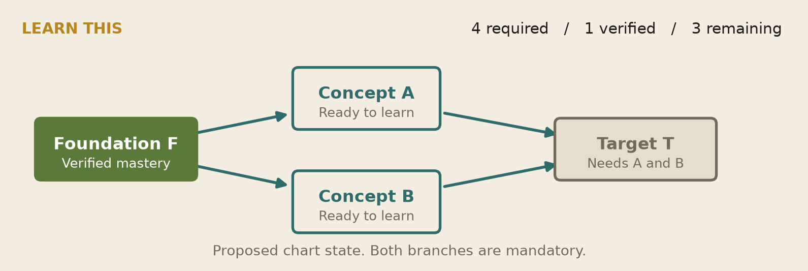
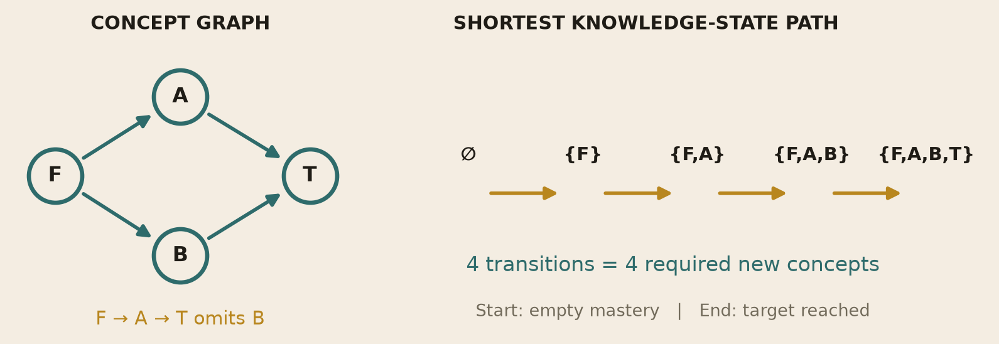
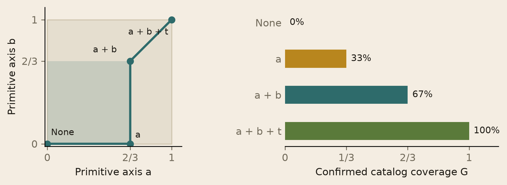
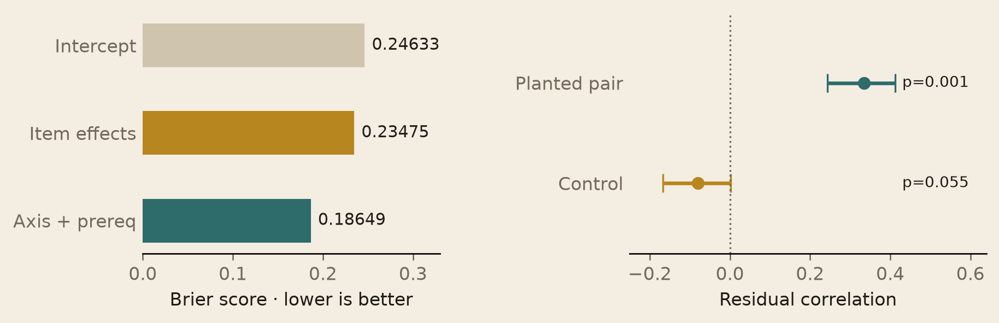

# Bucket learning system

## The learner experience

Bucket's proposed learning system gives every concept a route back to its foundations and gives each learner a view of their assessed knowledge. The learner chooses a destination, inspects its prerequisites and starts with the first concept they are ready to learn. Existing knowledge removes satisfied requirements from the remaining work. The chart preserves every mandatory branch.

The entry point is **Learn this** on a concept page, the Research OS map or the workspace. A target panel shows required, verified and remaining concepts. Counts appear only when prerequisite coverage is complete. Selecting a node opens its explanation and assessment; selecting an edge shows why the prerequisite is required and its source.



Filled nodes mean verified mastery. Outlined nodes identify ready lessons. Muted nodes need earlier concepts. A question marker identifies uncertainty in learner evidence or graph coverage. Reading records progress; passing an authorized assessment can establish mastery. A diagnostic gives experienced learners a way to demonstrate prior knowledge.

The chart and its compact line view share a destination. The line explains one chain. The chart contains the complete requirement structure. A forward study order converts that structure into actions. The learner's knowledge region expands as assessed attainment accumulates; current recall can decline and is shown separately.

**Status:** the implementation plan, Lean reference proofs and synthetic evaluation are delivered in PR 348. These product screens remain proposed. The work includes no live learner study or production planner deployment. DeepSeek and Laya were separate suggestions for agent tooling and are outside this feature. [1]

## The minimum learning requirement

Let the catalog be a directed acyclic graph. An edge from p to v means that p is mandatory before v. For target t, C(t) contains t and every prerequisite ancestor. Let M contain verified mastery. The remaining requirement set is:

$$R(t,M)=C(t)\setminus M$$

The first release treats every incoming prerequisite as required. Shared prerequisites appear once. A reviewed foundation supplies a valid stopping point. An absent edge alone supplies no evidence that a concept is foundational. Missing coverage, cycles or inaccessible requirements prevent a complete-plan claim.



**Lower bound.** Every valid route to t must include every unmastered ancestor. Learning one new concept per transition therefore requires at least the number of nodes in R.

**Attaining the bound.** A duplicate-free ordering of R that places every prerequisite before its dependent is feasible. It contains exactly the required new concepts. The lower and upper bounds agree:

$$d^*(M,t)=|R(t,M)|,\qquad c^*(M,t)=\sum_{v\in R(t,M)}w(v)$$

The cost equation uses fixed nonnegative integer weights. It models effort ticks. Human study time can depend on order and prior experience, so optimal time needs a richer model and measurements.

The shortest distance lives in the space of knowledge states: each transition adds a ready concept. A concept-graph chain can omit a required branch, as the diamond shows. With its foundation mastered, the example needs three new concepts. With the foundation and both branches mastered, it needs only the target. Alternative sufficient prerequisite groups require a later AND/OR model. [2]

## The Lean proof

The project compiles with Lean 4.33.1 and bundled Std. The theorem below is copied from `LearningSystem.lean`. `Closed` says mastered concepts include their prerequisites. `Enumerates` binds a duplicate-free list to the exact unmet target closure. `Earlier` certifies prerequisite order. `Path` permits fresh nodes whose prerequisites are already known. `After` combines initial mastery with the learned nodes. [2]

```lean
theorem minimum_unit_distance {edge : α → α → Prop} {known : α → Prop}
    {target : α} {order : List α} (hc : Closed edge known)
    (en : Enumerates edge known target order) (earlier : Earlier edge known order) :
    Path edge known order ∧ After known order target ∧
      ∀ steps, Path edge known steps → After known steps target → order.length ≤ steps.length := by
  refine ⟨earlier_path en.1 (fun v hv => ((en.2 v).mp hv).2) earlier, ?_, ?_⟩
  · by_cases h : known target
    · exact Or.inl h
    · exact Or.inr ((en.2 target).mpr ⟨Required.target, h⟩)
  · intro steps hp ht
    apply en.1.length_le_of_subset
    intro v hv
    have hv' := (en.2 v).mp hv
    exact remaining_necessary hc hp ht hv'.1 hv'.2
```

The conclusion establishes a valid target-reaching path whose length is no greater than any other valid target-reaching path. The final proof step applies prerequisite necessity and the cardinality bound for a duplicate-free subset.

The library also proves minimum fixed integer effort, decreasing remaining requirements as mastery grows, monotone integer-weight coverage and monotone squared integer-coordinate extent. The diamond has a compiled four-step feasibility proof and a proof rejecting the incomplete three-node chain.

The runtime checks mastery inside the target closure. `RestrictedKnown` maps that check into the proof's closed state. Its closure and remaining-set equivalence lemmas use no axioms. An unrelated inconsistency in another subject cannot invalidate this target's state.

Ten theorem declarations pass the axiom audit. Dependencies are empty or limited to Lean's standard `propext`, `Classical.choice` and `Quot.sound`. The check rejects proof placeholders and unapproved axioms.

**Proof boundary:** a correct prerequisite enumeration and ready-order certificate are explicit inputs. This project does not prove a general topological-sort implementation or a TypeScript translation. The real-valued normalization and sphere geometry remain outside these Lean theorems. Assessment validity and human learning outcomes remain empirical obligations.

## The learner's knowledge region

Bucket already has concept nodes, prerequisite relations and prime-factor decomposition. The proposed layer reuses those identities. A primitive axis is a reviewed concept dimension. Assigning prime labels or separating drawing axes does not establish statistical independence. The graph's existing corpus-weighted similarity vectors need a distinct learner measurement contract. [1]

For each concept v, take its set of distinct primitive supports S(v). Divide one unit of contribution across that set. With binary verified mastery m(v), define:

$$A_{vj}=\frac{\mathbf{1}[j\in S(v)]}{|S(v)|},\quad d_j=\sum_v A_{vj},\quad g_j=\frac{\sum_v A_{vj}m(v)}{d_j}$$

Keep the catalog and positive denominators fixed within a basis version. Repeated factors receive no extra weight. Unknown concepts contribute zero confirmed attainment while remaining labeled unknown. Unfactored concepts are counted outside the current basis.

$$G=\frac{\sum_j d_jg_j}{\sum_j d_j},\qquad r=\sqrt{\frac{\sum_j d_jg_j^2}{\sum_j d_j}}$$

G measures confirmed coverage of the factored catalog. The radial extent r summarizes the visualization; selecting an axis reveals the nodes and gaps behind its value. Sphere volume carries no validated intelligence interpretation.



In the fixture, a has support {a}, b has {b}, and t has {a,b}. Both denominators equal 1.5. Mastering a gives coordinates (2/3,0) and coverage 1/3. Adding b gives (2/3,2/3) and coverage 2/3. Adding t gives full coverage. Duplicate factors leave these results unchanged. [3]

The profile separates recorded attainment from current mastery. Minimal signed attainment receipts preserve past achievement after scored outcomes expire. Receipts cannot satisfy current prerequisites. Erasure and revocation can reduce recorded coverage. Growth claims assume a fixed basis without either operation; current mastery can shrink through forgetting or evidence expiry.

## Error and residual analysis

The executable reference enumerated 1,099 small DAGs under a fixed topological labeling. Across 57,060 valid mastery/target cases, prerequisite plans matched an independent breadth-first search over knowledge states. Distance, readiness and required-node inclusion errors were all zero. Fixtures cover missing foundations, cycles, shared dependencies and unrelated inconsistent mastery. [3]

The statistical experiment generated 1,200 synthetic learners answering eight items. Learners were split into 400 training, 200 calibration and 600 test records. Predictions were frozen before test scoring. The item bank was shared across splits; unseen-family transfer remains untested.

$$e_{ui}=y_{ui}-\hat p_{ui},\qquad B=\frac{1}{N}\sum_{u,i}e_{ui}^{2}$$

The residual e is the observed binary answer minus its predicted probability. Brier score B averages squared prediction errors. Lower values indicate better probability predictions on this test set.



Brier scores were 0.24633 for the intercept model, 0.23475 for item effects and 0.18649 for axis/prerequisite features. The generator includes those features, so this improvement tests the pipeline and supplies no learner-effectiveness evidence.

A planted shared latent factor produced residual correlation 0.33463, interval [0.24379,0.41299] and Holm-adjusted p=0.00100. The control pair had correlation -0.07997 and adjusted p=0.05497. Each used 2,000 learner bootstrap samples and 2,000 permutations. Non-rejection of the control does not prove independence. The intervals condition on the fitted model.

Future assessment data must test whether residual structure persists across subject and learner groups. Held-out item families, delayed retention and novel transfer tasks are required. Pairwise correlation cannot establish joint or nonlinear independence. These diagnostics can reject an axis model; they cannot certify a universal cognitive basis.

## Review and delivery

Exactly three critic rounds scored **8.05, 9.00 and 9.05 out of 10**. The final review passed with no open high or critical finding. Repairs introduced server-assessed mastery authority, target-local proof correspondence, fixed axis denominators and a retention contract for historical attainment. Scores assess the plan and prototype. [4]

Production work is split into four linked phases: assessed evidence and complete graph snapshots; the minimum prerequisite planner; chart and knowledge-region UI; empirical learner validation. Existing client progress cannot award certified mastery. Plans must bind graph and evidence revisions, respect access rights and return an incomplete state when authority or coverage is unavailable. The new route remains read-only.

The delivered artifacts include the implementation plan, formal source and reproducible results. Reproduction commands are:

```sh
bash learning/research-os/learning-system/lean/check.sh
python3 learning/research-os/learning-system/analysis/evaluate.py
```

No production authorization test or human study has run. The implemented mathematical model establishes minimum required concepts under its assumptions. The proposed learner product still needs its evidence service and UI, followed by outcome validation.

**Sources:** [1] PLAN.md. [2] lean/LearningSystem.lean and lean/README.md. [3] analysis/results/metrics.json and README.md. [4] CRITIC.md. All are under `learning/research-os/learning-system` in [PR 348](https://github.com/bucket-foundation/bucket-foundation/pull/348), reviewed candidate `db49e53d7`. The final review record is in `436b2bafe`.

**Visual method:** deterministic mathematical figures; palette and staged explanation adapted from Longtail's math renderers. Typography hierarchy follows adjacent AGFarms brand-kit guidance. Every plotted measurement comes from the saved synthetic results or the stated axis fixture.
