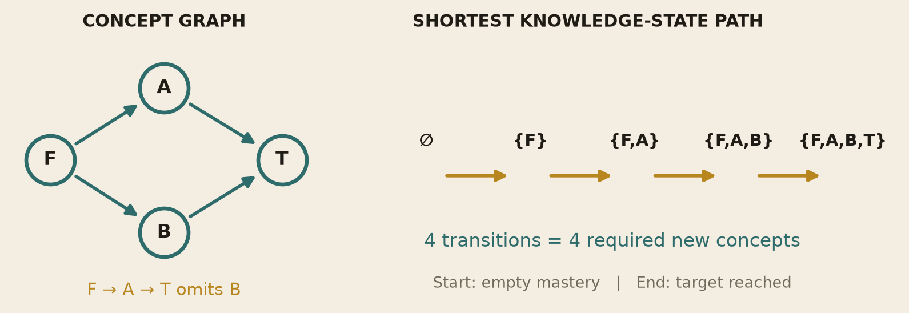
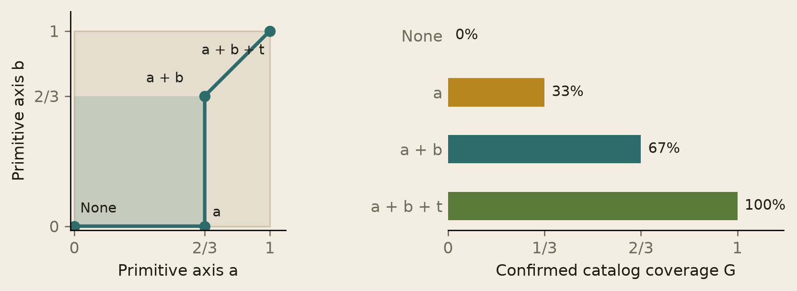
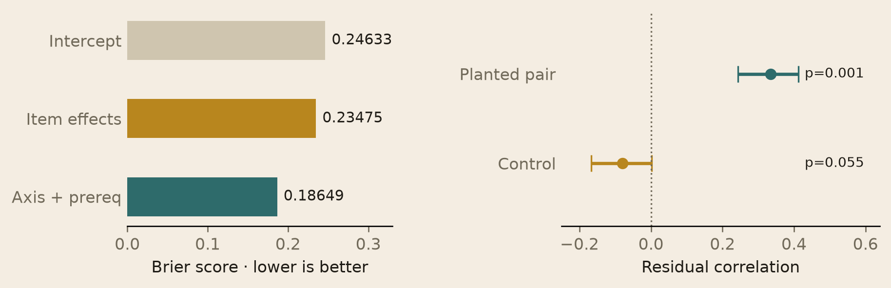
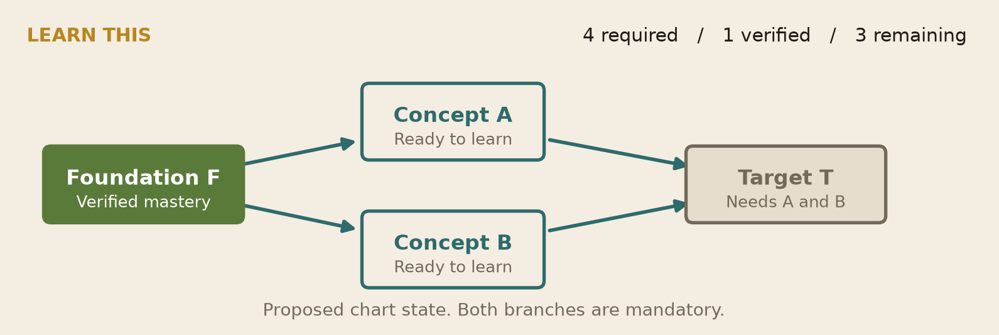

# Minimum prerequisite learning

## Research question and argument

**A mathematical research brief for Bucket.** Given a target concept and evidence of prior mastery, what is the least additional knowledge a learner must acquire? Can a graph identify that requirement, order it into feasible steps, and describe the learner's growing coverage without overstating what the measurements mean?

**Thesis.** For a fixed, complete mandatory-prerequisite graph, learning is a sequence of changes to a knowledge state. If each step adds one ready concept, the minimum number of steps equals the number of unmet concepts in the target's prerequisite closure. Fixed nonnegative concept costs give a corresponding minimum-effort result. These conclusions depend on explicit assumptions about the graph and initial mastery.

**Research process.** Define the question and the measurement target. Specify the graph, state transitions and assumptions. Derive necessity and sufficiency. Translate the contract into Lean. Compare an executable planner with an independent state-space search. Examine a candidate coverage measure and synthetic prediction residuals. Then specify the human study that could test educational value. Each stage has its own evidential boundary.

**Formal question Q1.** What is the minimum number of ready-node additions needed to reach a target? Sections 3 through 6 give the model and argument; section 8 maps the claims to the compiled Lean source.

**Measurement question Q2.** How can overlapping concept supports produce a bounded, duplicate-invariant coverage profile? Sections 9 and 10 derive one construction. Calling the coordinates independent would require further empirical evidence.

**Empirical question Q3.** Does presenting this plan improve retained knowledge or transfer per unit of study time? The synthetic experiments in sections 11 and 12 test software and statistical machinery. Section 13 proposes the human evaluation; no human effect has been measured here.

**Status.** The delivered work consists of an implementation plan, a formal reference model, executable synthetic analysis and proposed interface figures. Production planning, authoritative mastery assessment and learner outcome validation remain future work. DeepSeek and Laya were separate suggestions for agent tooling and are outside this feature. [1-4]

**Argument map.** Closed initial mastery plus ready additions preserves closure. Reaching the target then entails knowing every ancestor. A certified ordering of the unmet closure attains that lower bound. Measurement and educational benefit require additional arguments beyond this optimization theorem.

## Legend of terminology and notation

| Symbol or term | Meaning |
| --- | --- |
| V; E; p → v | Concept set; directed prerequisite relation; p is mandatory before v. |
| t; C(t) | Target concept; target together with all prerequisite ancestors. |
| M; M_C | Accepted initial mastery; M intersected with C(t). |
| R(t,M) | Unmet requirements C(t) ∖ M, including t when t is unmastered. |
| K; K_i | A knowledge state; the state after i valid additions. |
| Closed | Every immediate prerequisite of every known concept is known. |
| Ready concept | An unknown concept whose immediate prerequisites are all known. |
| π; n; cardinality of R | A finite ordered study sequence; its length; the number of distinct elements in R. |
| d*; w(v); c* | Minimum transition count; fixed nonnegative integer cost; minimum summed cost. |
| S(v); A_vj | Distinct primitive supports of concept v; its allocation to axis j. |
| J; d_j; g_j | Active axis set; fixed axis denominator; confirmed coordinate on axis j. |
| m(v); G; r | Binary assessed flag; catalog coverage; weighted radial extent. |
| Ω; N; y_ui; p̂_ui | Observed learner-item pairs; their count; binary answer; predicted probability. |
| e_ui; B; ρ | Prediction residual; Brier score; residual correlation. |
| ∈; ⊆; ∖; ∅; ∑ | Membership; subset; set difference; empty set; summation. |
| Lemma; theorem; corollary | Supporting claim; principal conditional claim; consequence of a theorem. |
| ■ | End of a completed proof. Hypotheses and proposed studies have no proof mark. |

**Reading conventions.** Arrows point from prerequisite to dependent concept. A set contains each concept once. An ordered list specifies when it is learned. Cardinality counts concepts; path length counts learning transitions. A concept-chain with three vertices has two graph edges, while learning those three unknown concepts would require three state transitions if the sequence were feasible.

**Foundation.** A reviewed stopping point within the chosen curriculum. Its status requires evidence of scope completeness. An empty list of visible incoming edges can also arise from missing data or access restrictions.

**Mastery and attainment.** Current mastery is accepted evidence for present readiness. Historical attainment records earlier achievement. Unknown means unassessed; it supplies no positive mastery evidence. A prime identifier names an axis and carries no automatic claim about independence or human cognition.

## The model and its assumptions

Fix a target t. Its closure C(t) is the smallest set containing t and containing every prerequisite of each member. The remaining set removes accepted mastery:

$$C(t)=\{t\}\cup\{p\in V:p\leadsto t\},\qquad R(t,M)=C(t)\setminus M$$

Here p ↝ t denotes a nonempty directed prerequisite path. The closure includes the target itself. A learner who has mastered every ancestor but has never demonstrated the target still has one required concept remaining.

**A1: semantic completeness.** Every encoded edge is mandatory, and the snapshot contains every prerequisite needed for this target within the declared curriculum. Alternative sufficient routes need an AND/OR model. Missing, inaccessible or unreviewed requirements produce an incomplete-plan state.

**A2: finite feasibility.** C(t) is finite. The implementation is expected to reject cycles and construct a prerequisite-first order. The Lean optimality theorem takes an exact enumeration and a ready-order certificate as arguments. A general sorting algorithm is outside that proof.

**A3: consistent initial mastery.** For each mastered v in C(t), every immediate prerequisite p of v is mastered. Restricting to M_C makes this a closed formal state. Unrelated inconsistencies outside the target closure do not change R(t,M).

**A4: monotone transitions.** A step adds one fresh concept after all its immediate prerequisites are known. Concepts are retained throughout this planning episode. The model excludes forgetting during execution, failed attempts and simultaneous mastery of several nodes.

$$K_{i+1}=K_i\cup\{v_i\},\quad v_i\notin K_i,\quad (p\to v_i\Rightarrow p\in K_i)$$

**A5: fixed costs.** For weighted planning, each concept has a fixed natural-number effort cost w(v), shared across the paths being compared. Zero is permitted. Study-time savings from a different order or a learner's changing proficiency require another cost model.

These are premises of the result. A proof cannot establish their truth for a real curriculum. In Bucket, source review, assessment authority, graph-version binding and coverage checks must supply the corresponding evidence before a plan receives a complete status. [1,2]

## Necessity of the prerequisite closure

**Lemma 1: closure is preserved.** Suppose K is closed and v is ready in K. Then K ∪ {v} is closed.

**Proof.** Let q belong to K ∪ {v}, and let p → q. If q belongs to K, closure of K gives p in K. If q is the new concept v, readiness gives p in K. In either case p belongs to K ∪ {v}. Repeating this argument over a finite valid sequence shows that every reached state is closed. ■

**Lemma 2: target mastery entails ancestor mastery.** If a closed state K contains t, then C(t) is a subset of K.

**Proof.** The target belongs to K by assumption. For an ancestor p, take a finite prerequisite path from p to t. Starting at t, closure supplies its predecessor; repeating along the path supplies p. Thus every member of C(t) belongs to K. This is induction on the closure derivation in Lean's `Required` definition. ■

**Theorem 1: necessary additions.** Start from a closed initial state M_C. Let π be any valid finite sequence reaching t. Every member of R(t,M) appears in π, including when π also learns concepts outside the target closure.

**Proof.** By Lemma 1, the final state is closed. By Lemma 2, it contains C(t). A member v of R(t,M) was absent from M_C. The final state is the union of M_C and the concepts added by π, so v must appear among those additions. Restriction to M_C leaves the remaining set unchanged. ■

$$R(t,M)\subseteq\{v:v\text{ occurs in }\pi\},\qquad |\pi|\geq |R(t,M)|$$

**Why consistency matters.** Suppose A → T, while the initial record claims mastery of T and omits A. A zero-step sequence already reaches T, yet R contains A. The lower bound would fail for that inconsistent starting state. The model therefore checks mastery closure before interpreting a claimed state as certified knowledge.

**Product consequence.** A mastery assertion can shorten a plan only when its evidence and prerequisite consistency satisfy the contract. Reading a page or setting a client progress flag cannot supply this mathematical premise. The proof concerns accepted states; assessment validity must be established by the product's evidence service. [1,2]

## Sufficiency and minimum distance

**Certificate.** Let π = (v₁, …, vₙ) list each element of R(t,M) once. Require that every prerequisite of vᵢ belongs to M_C or appears earlier in π. This is the ready-order certificate represented by Lean's `Earlier` predicate.

**Theorem 2: attained minimum distance.** Under A1 through A4, with such an exact enumeration and certificate, π is feasible, reaches t, and attains the minimum number of learning transitions:

$$d^*(M,t)=\min_{\pi\text{ valid},\ t\in K_{|\pi|}}|\pi|=|R(t,M)|$$

**Proof.** For feasibility, induct on the position in π. The first concept has all prerequisites in M_C. At position i, each prerequisite is either initially known or was learned at an earlier position. Each vᵢ is fresh because the list is duplicate-free and disjoint from initial mastery. Every transition is therefore valid. For reachability, either t is initially known or it belongs to R and hence to π. The sequence has |R| additions. Theorem 1 gives |R| as a lower bound for every valid target-reaching sequence, so this feasible sequence attains the bound. ■



**Counterexample to chain planning.** Let F → A, F → B, A → T and B → T, with empty mastery. The chain F, A, T omits B. After adding F and A, T is still unready. The valid sequence F, A, B, T attains distance four. Reversing A and B gives another optimum. Optimality does not imply a unique order.

**Boundary cases.** If F is already mastered, the distance is three. If F, A and B are mastered, it is one. If T belongs to a closed mastered state, its closure is already known and the distance is zero. A shared foundation contributes once to R even when several branches require it.

The optimized object is a path through knowledge states. Its cost counts demonstrated concept additions. The theorem supplies no estimate of minutes, assessment attempts or cognitive difficulty. [2,3]

## Weighted effort and growing mastery

For a valid sequence π, define its fixed effort cost as the sum of the costs of its additions. Under A5, all weights are nonnegative integers.

$$W(\pi)=\sum_{v\in\pi}w(v),\qquad c^*(M,t)=\sum_{v\in R(t,M)}w(v)$$

**Theorem 3: minimum fixed effort.** Assume closed initial mastery, exact enumeration and the ready-order certificate from Theorem 2. The certified sequence minimizes W over every valid sequence reaching t.

**Proof.** Theorem 1 requires every valid sequence to contain each member of R. Summing the nonnegative costs of these distinct required concepts gives a lower bound on that sequence's total cost. The certified sequence contains exactly R, so its cost equals the lower bound. ■

**Example.** Give F, A, B and T respective costs 2, 3, 5 and 4. Empty mastery gives minimum cost 14. Mastering F first leaves cost 12 and three transitions. Interchanging A and B preserves the cost because the weights are fixed. Zero-cost extra nodes can create additional optimal sequences; the minimum required set remains R.

**Corollary 3.1: mastery reduces the remaining set.** For a fixed graph and target, if M₁ is a subset of M₂, then:

$$R(t,M_2)\subseteq R(t,M_1),\qquad |R(t,M_2)|\leq |R(t,M_1)|$$

**Proof.** A concept in C(t) absent from the larger set M₂ is also absent from M₁. This proves the inclusion. Finite-set cardinality preserves the resulting inequality. With fixed nonnegative weights, the same inclusion gives a nonincreasing required-cost sum. ■

Interpreting these counts as attained optimal distances requires each initial state to satisfy closure and possess a feasible certificate. The set inclusion itself requires neither feasibility nor a learning mechanism.

**Where the cost theorem stops.** If learning A makes B cheaper, w(B) depends on history. If a lesson teaches several concepts, transitions add sets. If either of two subjects suffices, prerequisites become alternatives. Such models change the optimization problem. No minimum-time or AND/OR optimality claim follows from Theorem 3. Forgetting also breaks the monotone-state premise. [2]

## From theorem to executable planner

**Input contract.** A request binds the target, a versioned graph snapshot, accepted evidence and the curriculum's reviewed foundations. The planner checks that the target exists, prerequisite coverage is complete, required content is accessible, and mastered nodes in the closure satisfy target-local consistency. A cycle or missing authority produces a typed incomplete or invalid result.

**Construction.** Traverse incoming prerequisite edges from t to collect C(t). Remove accepted mastery to obtain R. Order the remaining concepts so that each prerequisite is known or earlier. Deduplicate concept identities before counting costs. Return the order together with graph and evidence revisions, assumptions, and the source justification for each prerequisite.

**Independent certificate check.** Start K at M_C. For each emitted concept, verify that it is fresh and that all direct prerequisites belong to K, then add it. At the end, verify that t belongs to K and that the emitted set equals R. These checks connect a proposed list to the predicates in the theorem.

**Complexity argument.** With adjacency lists and constant-time membership, closure traversal visits each required vertex and each incident prerequisite edge once. A topological ordering by indegrees has the same asymptotic bound. Let E_C contain edges within the ancestor closure:

$$T_{\mathrm{plan}}=O(|C(t)|+|E_C|),\qquad S_{\mathrm{plan}}=O(|C(t)|+|E_C|)$$

The bound assumes the graph is loaded and indexed. It excludes database access, access-control queries, evidence verification and assessment. The existing Python evaluator is a reference implementation; this asymptotic argument concerns the stated adjacency-list construction and is outside the Lean proof.

**Why use state-space search in tests?** Breadth-first search over all ready additions solves the unit-cost reference problem by an independent route. A finite catalog with k concepts has at most 2ᵏ knowledge subsets. That upper bound makes exhaustive state search useful for small tests, while the closure theorem motivates the production construction.

**Failure semantics.** An inaccessible prerequisite creates unknown coverage. An unreviewed root requires source review. Inconsistent mastery requires reconciliation or assessment. A cached plan loses its certification when its graph or evidence revision changes. Producing an appealing route does not remove these obligations. [1,3]

## The machine-checked proof boundary

The formal source uses Lean 4.33.1 and bundled Std. `Required` defines the inductive target closure; `Closed` defines prerequisite-consistent mastery; `Path` permits fresh, ready additions; and `After` combines initial knowledge with the additions. `Enumerates` requires a duplicate-free list equal to the remaining closure. `Earlier` certifies readiness against the preceding prefix. [2]

```lean
theorem minimum_unit_distance {edge : α → α → Prop} {known : α → Prop}
    {target : α} {order : List α} (hc : Closed edge known)
    (en : Enumerates edge known target order) (earlier : Earlier edge known order) :
    Path edge known order ∧ After known order target ∧
      ∀ steps, Path edge known steps → After known steps target → order.length ≤ steps.length := by
  refine ⟨earlier_path en.1 (fun v hv => ((en.2 v).mp hv).2) earlier, ?_, ?_⟩
  · by_cases h : known target
    · exact Or.inl h
    · exact Or.inr ((en.2 target).mpr ⟨Required.target, h⟩)
  · intro steps hp ht
    apply en.1.length_le_of_subset
    intro v hv
    have hv' := (en.2 v).mp hv
    exact remaining_necessary hc hp ht hv'.1 hv'.2
```

**Correspondence.** Lemmas 1 and 2 correspond to `after_closed` and `required_known`; Theorem 1 to `remaining_necessary`; Theorem 2 to `minimum_unit_distance`; and Theorem 3 to `minimum_weighted_effort`. `restricted_closed` and `restricted_remaining` justify the target-local restriction. `distance_antitone` supplies the remaining-count comparison.

**Recorded checks.** Compilation and ten theorem axiom outputs are recorded in `lean/check-output.txt`. Dependencies are empty or limited to Lean's standard `propext`, `Classical.choice` and `Quot.sound`. The audit rejects proof holes, custom axioms and `native_decide`. No Lean source is changed by this expanded exposition.

**Scope distinction.** The certificate is an explicit input. The formalization does not construct it from an arbitrary finite DAG, verify a sorting implementation, prove the TypeScript planner, validate assessments, or establish human learning gains. The normalized real-valued coverage arguments on the next pages are human proofs. Lean separately proves natural-weight coverage and integer-coordinate squared-extent monotonicity. The displayed code is checked against the saved source during PDF generation.

## Constructing the knowledge coordinates

A knowledge sphere needs a declared measurement rule. Fix a finite, nonempty catalog of factored concepts V and a finite set J of active primitive axes. Each concept has a nonempty set of distinct supports S(v). Unfactored concepts are reported outside this denominator. Repeated support labels are removed before allocation.

$$A_{vj}=\frac{\mathbf{1}[j\in S(v)]}{|S(v)|},\qquad d_j=\sum_{v\in V}A_{vj}>0$$

Every concept contributes total allocation one across its supports. Let m(v) be one when the chosen evidence rule confirms that concept and zero otherwise. For each active axis, define confirmed coordinate g_j; combine these into catalog coverage G and weighted radial extent r:

$$g_j=\frac{\sum_v A_{vj}m(v)}{d_j},\qquad G=\frac{\sum_j d_jg_j}{\sum_j d_j},\qquad r=\sqrt{\frac{\sum_j d_jg_j^2}{\sum_j d_j}}$$

**Interpretation.** The coordinates show where confirmed concepts fall in a declared basis. Unknown concepts contribute zero confirmed attainment and retain their unknown label. The definition assigns no probability of ignorance. Fixed weights and denominators make comparison within one version interpretable.



**Worked fixture.** Let S(a)={a}, S(b)={b} and S(t)={a,b}. Then d_a=d_b=3/2. Mastering a gives g=(2/3,0), G=1/3 and r²=2/9. Adding b gives g=(2/3,2/3), G=2/3 and r²=4/9. Adding t gives G=r=1. Repeating a inside the input support of t changes none of these quantities after set deduplication.

The fixture concerns a coverage calculation. Its flags can be enumerated without imposing a prerequisite graph. Feasible learning sequences still require the planning contract. Prime names supply identities for the axes; statistical independence remains a separate hypothesis. [1,3]

## What the coverage measure proves

**Proposition 4: boundedness and catalog identity.** Under the finite, nonempty, factored-catalog assumptions, every g_j lies in [0,1], and G equals the fraction of catalog concepts with confirmed flags:

$$G=\frac{\sum_{v\in V}m(v)}{|V|},\qquad 0\leq G\leq 1$$

**Proof.** Since 0 ≤ m(v) ≤ 1 and A_vj ≥ 0, the numerator of g_j lies between zero and d_j. Each row of A sums to one because S(v) contains exactly |S(v)| distinct supports. Interchanging finite sums gives ∑ⱼ d_j = |V| and ∑ⱼ d_jg_j = ∑ᵥ m(v). Substitution yields the identity and bounds. ■

**Proposition 5: monotonicity.** Keep V, S and d fixed. If every flag m(v) is preserved or increases, then every coordinate g_j, coverage G and radial extent r is preserved or increases.

**Proof.** The numerator of each g_j is a nonnegative weighted sum of flags, so it cannot decrease. Its denominator is fixed and positive. This gives coordinate monotonicity and hence monotonicity of their weighted average G. Coordinates are nonnegative, so squaring preserves their order. The weighted sum of squares and the square-root operation also preserve order, proving the claim for r. ■

**Proposition 6: radial bounds.** The same assumptions give G ≤ r ≤ √G.

**Proof.** Write D=∑ⱼ d_j. The nonnegative weighted variance ∑ⱼ d_j(g_j−G)²/D expands to r²−G², so r²≥G². Also g_j²≤g_j on [0,1], giving r²≤G. Taking nonnegative square roots gives both bounds. ■

**Consequence.** Radial extent and coverage measure different properties. Profiles with the same coverage can have different radial extent. The value r has no established interpretation as intelligence or general competence. A geometric sphere-volume formula would add no validation of that interpretation.

These real-valued results are human derivations supplied in this expanded brief. They are outside the present Lean formalization. Historical attainment can satisfy the monotonicity premise within a basis version, subject to erasure and revocation. Current recall can decline; catalog expansion and basis changes alter the comparison contract. [1,2]

## Research method and error functions

**Graph experiment.** The saved evaluation enumerates every edge subset under a fixed topological labeling for one through five nodes: 1,099 DAGs. It enumerates downward-closed mastery sets and targets, producing 57,060 cases. Every DAG on those node counts has a topologically labeled representative in this family. This finite test supplies bounded evidence, alongside the general conditional theorem. [3]

The candidate computes the unmet closure and a prerequisite-first order. The reference performs breadth-first search over ready additions and stops when the target is reached. It does not reuse the candidate closure traversal. Define signed distance error Δ as candidate length minus the reference minimum; define omission and readiness counts as follows:

$$\Delta=|\pi_{\mathrm{candidate}}|-d_{\mathrm{BFS}},\qquad E_{\mathrm{omit}}=|R\setminus\mathrm{set}(\pi)|$$

$$E_{\mathrm{ready}}=\sum_i\mathbf{1}[\exists p:(p\to v_i)\wedge(p\notin K_i)]$$

Here i indexes the candidate transitions from the pre-transition state K_i. Duplicate concepts and target reachability require their own checks; zero omission alone does not establish feasibility. Fixtures also exercise missing nodes, unreviewed foundations, cycles, mastered targets and unrelated inconsistent mastery.

**Statistical experiment.** Generate 1,200 synthetic learners and eight items per learner. Split by learner into 400 training, 200 calibration and 600 test records. Fit an intercept model, an item-intercept baseline and a model with item effects plus synthetic axis/prerequisite covariates. Use ridge coefficient 0.01. Fit calibration intercept and slope on the calibration learners and freeze predictions before test scoring.

$$e_{ui}=y_{ui}-\hat p_{ui},\qquad B=\frac{1}{N}\sum_{(u,i)\in\Omega}e_{ui}^2,\quad N=|\Omega|$$

On the test split, N=600×8=4,800 observed responses. Brier score averages squared probability error over outcomes. These repeated responses are clustered within learners. The item bank is shared across splits, so held-out learner evaluation supplies no unseen-item-family evidence.

**Residual diagnostic.** Compute correlation between the residual vectors of two prespecified item pairs. Bootstrap learners 2,000 times, using 97.5% pair intervals for a Bonferroni 95% family target. Run 2,000 learner permutations per pair and apply Holm correction to the two p-values. The intervals condition on the fitted model; they omit fitting uncertainty. [3]

## Results and their interpretation

**Graph results.** Across all 57,060 enumerated cases, distance error, omitted-required-node count and readiness-error count were zero. The diamond counterexample rejects the incomplete chain. Other fixtures return typed failures for cycles, missing concepts, unreviewed foundations and inconsistent target-local mastery. Fixed unequal costs were outside this executable graph experiment; their conditional result is supplied by Lean. [2,3]

| Model or diagnostic | Saved test result |
| --- | --- |
| Intercept-only prediction | Brier score 0.24633 |
| Item-intercept baseline | Brier score 0.23475 |
| Axis and prerequisite covariates | Brier score 0.18649 |
| Improvement over item baseline | Brier reduction 0.04826 |
| Planted residual pair | Correlation 0.33463; adjusted p=0.00100 |
| Control residual pair | Correlation −0.07997; adjusted p=0.05497 |



The planted pair's interval is [0.24379,0.41299]. The control interval is [−0.16685,0.00182]. The planted shared latent factor remains detectable after conditioning on the fitted observed features. The control's non-rejection supplies no proof of independence.

**What follows.** The tested reference planner agrees with independent state search on the enumerated cases. The statistical pipeline detects the residual structure planted in its generator. Because that generator also contains the axis/prerequisite predictors, their predictive advantage is expected by construction.

**What remains open.** These observations establish no educational effect, validated primitive basis, true real-world prerequisite relation or calibrated production mastery estimate. Residual dependence can arise from omitted skill, item wording, response habits or model misspecification. Pairwise zero correlation would also leave nonlinear and higher-order dependence unresolved. No result here warrants a claim that the proposed axes are independent dimensions of intelligence.

## Proposed empirical test

**Hypothesis H1.** For a specified curriculum, access to an assessed prerequisite plan improves delayed transfer relative to a fixed baseline. This is a research hypothesis with no completed human experiment behind it.

**Protocol status.** This is a proposed alternative to PLAN.md, which specifies time-to-target with seven-day retention noninferiority. The present design makes delayed transfer primary. Select one protocol and preregister its outcome and analysis before recruitment; the study design remains unsettled.

**Target and comparison.** Recruit consenting learners within a declared subject and starting-skill range. Randomly assign learners to the prerequisite-plan interface or a fixed topic-order interface with the same lessons and assessment access. Stratify assignment by baseline skill if prespecified. Record contamination where participants use both conditions.

**Primary outcome.** Select one delayed novel-transfer score before recruitment. Define the delay, scoring rubric and handling of missing outcomes. Use items from held-out families that assess the intended skill without reproducing lesson answers. Keep assessor access to assignment masked where feasible. Treat time-on-task as an additional prespecified outcome or resource measure; a ratio outcome needs its own analysis plan.

**Estimand.** Let Y_u(1) and Y_u(0) denote learner u's potential delayed-transfer scores under the two assignments. The average assignment effect in the enrolled population is:

$$\tau=\mathbb{E}[Y_u(1)-Y_u(0)]$$

Identification requires the trial's randomization and outcome assumptions, including attention to interference and attrition. A between-arm estimate with uncertainty should follow the prespecified analysis. This equation defines the target; it supplies no measured effect or proof of effectiveness.

**Power and uncertainty.** Choose a smallest effect worth detecting, estimate score variability and expected attrition in a pilot, and calculate sample size before a confirmatory study. Report assignment, exclusions, missingness and confidence intervals. Prespecify subgroup and secondary analyses with a multiplicity policy. No sample size is justified by the synthetic experiment alone.

**Axis challenge.** On separate held-out learners and item families, compare the axis model with item effects and simpler skill groupings. Inspect calibration and residual dependence across groups. A proposed basis must survive these comparisons before receiving a predictive interpretation.

**Ethics and measurement authority.** Separate consented research outcomes from product permissions. Version assessment evidence, minimize retained personal data and define erasure. A historical receipt may record attainment after scored outcomes expire; it cannot certify current readiness. The study protocol remains proposed and needs approval through the applicable research process. [1]

## The proposed learner experience

The concept page, Research OS map or workspace offers **Learn this**. Choosing a target opens its prerequisite chart with required, verified and remaining counts. Every count binds to a graph and evidence revision. Missing coverage produces an incomplete state before the interface presents a minimum-plan claim.



**Chart semantics.** Filled nodes show verified mastery, outlines show ready concepts, and muted nodes show prerequisites still needed. An uncertainty marker identifies missing graph or evidence coverage. Selecting an edge exposes its source and requirement rationale. Selecting a node opens its explanation and assessment.

**Study order.** The complete chart preserves every mandatory branch. A compact line can explain a selected chain; the prerequisite-first study list supplies the complete sequence justified by the theorem. Experienced learners can take a diagnostic to establish prior knowledge through accepted evidence.

**Progress semantics.** Reading records activity. An authorized assessment writer can record evidence used for mastery. Legacy client progress cannot award certified mastery. Failed or expired evidence changes readiness according to the declared policy, and graph/evidence changes invalidate affected cached plans.

**Knowledge region.** The profile shows G, axis coordinates and radial extent together, with the catalog denominator and basis version visible. Selecting an axis reveals contributing concepts and gaps. Historical attainment and current recall have distinct displays. Unknown concepts retain their unknown status; a single scalar does not explain the profile's gaps.

**Release boundary.** These screens are proposed. The research artifacts supply a mathematical contract and reproducible tests. Product delivery still requires authoritative evidence, complete graph snapshots, implementation-level authorization tests, a planner bound to revisions, and empirical learner evaluation. The proof's assumptions become acceptance obligations at those boundaries. [1,4]

## Reproduction and sources

**Formal reproduction.** Run `bash learning/research-os/learning-system/lean/check.sh`. The pinned toolchain is Lean 4.33.1; the manifest uses bundled Std without external packages. Read `lean/check-output.txt` for the recorded ten-theorem axiom audit. The expanded document preserves the existing Lean source.

**Analysis reproduction.** Run `python3 learning/research-os/learning-system/analysis/evaluate.py` with the pinned analysis dependency. The recorded environment is Python 3.13.13 and NumPy 2.5.1, with seed 20260925. Floating-point output can vary by numerical library. `analysis/results/metrics.json` contains the full measurements plotted here.

**Document reproduction.** Run `python3 learning/research-os/learning-system/brief/build.py` with ReportLab, Matplotlib and NumPy. The builder checks that the displayed Lean excerpt occurs in the formal source, renders the equations and figures, and writes `output/pdf/bucket-learning-system-brief.pdf`. Proof-end squares mark completed prose arguments. The typography and figures are generated from the source text and saved measurements.

**Sources and evidence types.** Paths below are relative to `learning/research-os/learning-system/`. They identify the research artifacts behind the argument; this document makes no literature-priority claim.

| Reference | Artifact and role |
| --- | --- |
| [1] | PLAN.md: proposed learner workflow, mathematical contract, measurement and evidence policies. |
| [2] | lean/LearningSystem.lean, lean/README.md and check-output.txt: definitions, compiled theorems, assumptions and axiom audit. |
| [3] | analysis/evaluate.py, analysis/results/metrics.json and README.md: reference experiments, saved data and methods. |
| [4] | CRITIC.md: original three-round review of the plan and formal/synthetic prototype. |

The original critic rounds scored 8.05, 9.00 and 9.05 out of 10. The final verdict concerned its named prototype revision. That score does not certify new prose, a production implementation or educational outcomes. The expanded brief receives a separate editorial and mathematical review recorded alongside its source.

**Conclusion.** Under a complete mandatory-prerequisite model, consistent initial mastery and a feasible certificate, the unmet closure is both necessary and sufficient for minimum concept-count learning. Fixed nonnegative costs yield the corresponding effort optimum. A versioned support allocation yields a bounded coverage profile with stated monotonicity properties. Human benefit remains an empirical question whose proposed test must supply independent outcome evidence.

The implementation plan and original proof artifacts are delivered through [PR 348](https://github.com/bucket-foundation/bucket-foundation/pull/348). The resulting contribution is a conditional argument with executable checks and a testable product proposal.
