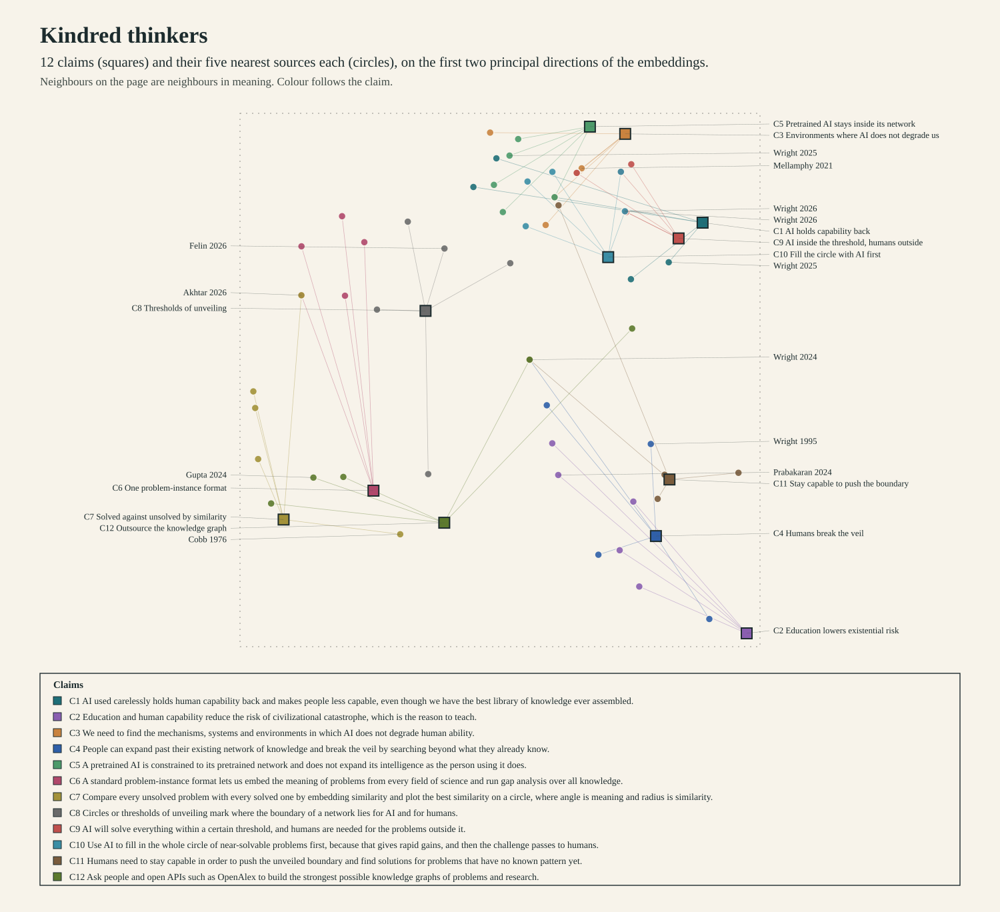

<!-- voice-ignore-file -->
# Kindred thinkers for the frontier thesis

## Corpus makeup

| Source set | Items | How it was chosen |
|---|---|---|
| Robert Wright corpus | 1869 passages | A local source the founder chose: Wright's newsletter, legacy essays and public Nonzero video transcripts. It is a single author's body of work, not a sample of the literature. |
| Crossref works | 821 works with abstracts | 35 keyword queries, 25 results each, ranked by Crossref relevance. |
| OpenAlex works | 0 works | Planned as the main literature index. The daily OpenAlex quota was spent before the run (HTTP 429, reset in about 20 hours), so none returned data. |

The private call transcript with John Horgan is not used. Embeddings: BAAI/bge-small-en-v1.5, the model of the solvability atlas. Rankings below are kept per source set: a Wright passage ranking first says what Wright wrote, and says nothing about the literature.

OpenAlex was not queried: its daily quota was already spent when the run began, so no request was sent.

## Highest similarity in the literature works

| Rank | First author | Claims in its top five | Best similarity | Nearest work |
|---|---|---|---|---|
| 1 | Avigail Ferdman | 6 (C1, C3, C5, C9, C10, C11) | 0.773 | AI deskilling is a structural problem |
| 2 | Yuqing Ren | 3 (C1, C3, C5) | 0.777 | Unpacking Human and AI Complementarity: Insights from Recent Works |
| 3 | Andrew J. Waters | 3 (C1, C5, C10) | 0.711 | Impact of AI on Human Expertise: Canaries in the Coalmine |
| 4 | Nandita Biswas Mellamphy | 2 (C3, C9) | 0.786 | Humans “in the Loop”? |
| 5 | PARTHA ROY | 2 (C3, C9) | 0.774 | AI and the Irreplaceability of Human Effort: An Inquiry into Labor Economies and Ethics |
| 6 | Kun Yuan | 2 (C3, C9) | 0.772 | AI-Related Human Existential Risk and the Civilizational Subject: From Species Survival to Civilizational Subjecthood |
| 7 | Mohammad Amir Khusru Akhtar | 2 (C6, C7) | 0.712 | Evaluating AI-Generated Scientific Questions with Discovery Plane Theory: A Repeated-Measures Computational Benchmark Across Twenty Scientific Fields |
| 8 | Jeffrey Coldren | 2 (C4, C11) | 0.655 | Conditions under which college students cease learning |
| 9 | Richard J. Lane | 2 (C4, C12) | 0.654 | Dispersed/Networked Open Social Discovery Research: Applications for Humanistic Machine Learning & Topic Modelling |
| 10 | Aurore Haas | 2 (C4, C11) | 0.648 | Crowding at the frontier: boundary spanners, gatekeepers and knowledge brokers |

## Highest similarity in the Wright corpus

| Rank | Author | Claims in its top five | Best similarity | Nearest work |
|---|---|---|---|---|
| 1 | Robert Wright | 12 (C1, C2, C3, C4, C5, C6, C7, C8, C9, C10, C11, C12) | 0.782 | AI and the Noosphere, Part II |
| 2 | Jacob Bacharach (review of The God Test) | 3 (C1, C3, C9) | 0.772 | Adopt AI or Die? |

## Claims and nearest sources

### C1 AI holds capability back

> we are treating AI like it is um turning us stupid. Really, it is holding us back.
> (founder voice notes, line 8)

Claim as embedded: AI used carelessly holds human capability back and makes people less capable, even though we have the best library of knowledge ever assembled.

Literature works:

1. Andrew J. Waters, Andrea Brancaccio, Shmuel Juni et al. (2026). *Impact of AI on Human Expertise: Canaries in the Coalmine*. [https://doi.org/10.31234/osf.io/k3p8s_v1](https://doi.org/10.31234/osf.io/k3p8s_v1). Similarity 0.705.
   > "This raises the question: what happens to human expertise when AI systems equal or exceed expert human performance?" (sentence similarity 0.730)
2. Avigail Ferdman (2025). *AI deskilling is a structural problem*. [https://doi.org/10.1007/s00146-025-02686-z](https://doi.org/10.1007/s00146-025-02686-z). Similarity 0.701.
   > "The more artificial intelligence (AI) replaces valuable human activity, the more it risks deskilling humans of their human capacities." (sentence similarity 0.773)
3. Jane Jiang (2026). *Keeping Humans in the Loop*. [https://doi.org/10.23974/ijol.2026.vol11.3.660](https://doi.org/10.23974/ijol.2026.vol11.3.660). Similarity 0.699.
   > "While existing literature often emphasizes efficiency, automation, and scalability, this paper argues that the effectiveness of AI systems in academic environments depends on sustained human..." (sentence similarity 0.667)
4. Yuqing Ren, Xuefei (Nancy) Deng, KD Joshi (2024). *Unpacking Human and AI Complementarity: Insights from Recent Works*. [https://doi.org/10.2139/ssrn.4803692](https://doi.org/10.2139/ssrn.4803692). Similarity 0.698.
   > "To work effectively with AI, humans need to possess not only AI skills but also domain expertise, job skills, and metaknowledge to accurately assess human capabilities and AI capabilities." (sentence similarity 0.706)
5. Katharina A. Zweig (2022). *Awkward Intelligence*. [https://doi.org/10.7551/mitpress/13915.001.0001](https://doi.org/10.7551/mitpress/13915.001.0001). Similarity 0.688.
   > "She presents the good and the bad: AI is good at processing vast quantities of data that humans cannot—but it's bad at making judgments about people." (sentence similarity 0.719)

Wright corpus passages:

1. Robert Wright (2025). *Is Marc Andreessen just flat-out dumb?*. [https://www.nonzero.org/p/is-marc-andreessen-just-flat-out](https://www.nonzero.org/p/is-marc-andreessen-just-flat-out). Similarity 0.710.
   > "Indeed it’s because of this value—because AI can serve as creative tool, educator, counselor, whatever—that so many people will spend so much time with AIs and become so dependent on them." (sentence similarity 0.701)
2. Robert Wright (2026). *What is the \"God test\"?*. [https://www.nonzero.org/p/what-is-the-god-test](https://www.nonzero.org/p/what-is-the-god-test). Similarity 0.704.
   > "I don’t mean to dwell unduly on the potential downsides of AI." (sentence similarity 0.653)
3. Jacob Bacharach (review of The God Test) (2026). *Adopt AI or Die?*. [https://newrepublic.com/article/213738/artificial-intelligence-god-test-adopt-ai-die](https://newrepublic.com/article/213738/artificial-intelligence-god-test-adopt-ai-die). Similarity 0.692.
   > "The problem with both AI doomers and AI evangelists (often, including in Wright, two tendencies coexisting in one body) is that they seem to have forgotten the virtue..." (sentence similarity 0.668)
4. Robert Wright, Connor Echols, Danny Fenster (2025). *Israel Lays Bare Its One-State Solution*. [https://www.nonzero.org/p/israel-lays-bare-its-one-state-solution](https://www.nonzero.org/p/israel-lays-bare-its-one-state-solution). Similarity 0.686.
   > "But, one of the study’s authors told Fortune, that may largely reflect the shortcomings not of AIs but of humans—humans who do a bad job of adapting the technology to their company’s needs." (sentence similarity 0.707)
5. Robert Wright (2026). *The Singularity is Clear*. [https://www.nonzero.org/p/the-singularity-is-clear-e06](https://www.nonzero.org/p/the-singularity-is-clear-e06). Similarity 0.685.
   > "But it could come sooner than most institutions are prepared for.” And one consequence might be to “increase the risks of humans losing control over AI systems.”" (sentence similarity 0.705)

### C2 Education lowers existential risk

> education and human capability, human intellect, is all extremely important to uh minimizing that existential risk
> (founder voice notes, line 8)

Claim as embedded: Education and human capability reduce the risk of civilizational catastrophe, which is the reason to teach.

Literature works:

1. Madhu Prabakaran (2024). *Harmonizing Teaching and Learning: Reconciling Schooling and Education with Civilizational Dialectics*. [https://doi.org/10.2139/ssrn.4666443](https://doi.org/10.2139/ssrn.4666443). Similarity 0.666.
   > "Schooling moulds for societal roles, while education elevates the human condition, embracing progress." (sentence similarity 0.680)
2. Stefan Schubert, Lucius Caviola, Nadira S. Faber (2019). *The Psychology of Existential Risk: Moral Judgments about Human Extinction*. [https://doi.org/10.1038/s41598-019-50145-9](https://doi.org/10.1038/s41598-019-50145-9). Similarity 0.654.
   > "The 21st century will likely see growing risks of human extinction, but currently, relatively small resources are invested in reducing such existential risks." (sentence similarity 0.684)
3. unknown (2023). *US takes action to avert human existential catastrophe: The Global Catastrophic Risk Management Act (2022)*. [https://doi.org/10.59350/adaptresearchwriting.3940](https://doi.org/10.59350/adaptresearchwriting.3940). Similarity 0.643.
   > "Photo by Joshua Sukoff on Unsplash TLDR: Global catastrophic risks (GCRs) include those events or incidents consequential enough to significantly harm or set back human civilization at the..." (sentence similarity 0.659)
4. Vincenzo Alfano (2026). *When Communication Enables Catastrophe: Nuclear Risk and the Short Lifetimes of Technological Civilizations*. [https://doi.org/10.1111/risa.70339](https://doi.org/10.1111/risa.70339). Similarity 0.635.
   > "These hazards plausibly exceed natural extinction risks but may decline substantially with improved governance and control systems." (sentence similarity 0.665)
5. Ayazhan Sagikyzy, Maira Shurshitbai, Zebiniso Akhmedova (2021). *UPBRINGING AND EDUCATION AS FACTORS OF HUMAN CAPITAL DEVELOPMENT*. [https://doi.org/10.48010/2021.2/1999-5849.03](https://doi.org/10.48010/2021.2/1999-5849.03). Similarity 0.634.
   > "the goal of education is the need to develop a value-oriented personality." (sentence similarity 0.670)

Wright corpus passages:

1. Robert Wright (1995). *The Evolution of Despair*. [https://time.com/archive/6727815/the-evolution-of-despair/](https://time.com/archive/6727815/the-evolution-of-despair/). Similarity 0.624.
   > "The good news for our ancestors was that collectively fending off starvation or saber-toothed tigers forged bonds of a depth moderners can barely imagine." (sentence similarity 0.581)
2. Robert Wright (2024). *Israel\u2019s Ethnic Cleansing Push*. [https://www.nonzero.org/p/israels-ethnic-cleansing-push](https://www.nonzero.org/p/israels-ethnic-cleansing-push). Similarity 0.616.
   > "“extremely bad outcomes (for example, human extinction).” If you average out the respondents’ estimates of the probability of such outcomes, you get a 9 percent probability, down from..." (sentence similarity 0.605)
3. Robert Wright (2026). *War Isn't a Zero-Sum Game*. [https://www.nonzero.org/p/war-isnt-a-zero-sum-game](https://www.nonzero.org/p/war-isnt-a-zero-sum-game). Similarity 0.615.
   > "So if you add this dimension—if you expand your tabulation of war’s consequences beyond loss of life, to include things like land and future security—it’s possible for a nation to come out ahead even..." (sentence similarity 0.582)
4. Robert Wright (2026). *What is the \"God test\"?*. [https://www.nonzero.org/p/what-is-the-god-test](https://www.nonzero.org/p/what-is-the-god-test). Similarity 0.611.
   > "The promised upsides are real: Making good education and good medical care abundant where they’re now scarce, powering scientific breakthroughs that help society broadly, curing cancer and other..." (sentence similarity 0.630)
5. Robert Wright (2023). *The Hidden Source of AI\u2019s Emerging Power*. [https://www.nonzero.org/p/the-hidden-source-of-ais-emerging](https://www.nonzero.org/p/the-hidden-source-of-ais-emerging). Similarity 0.606.
   > "The specific emotions and thoughts of individual students will depend on various factors, and it's important to remember that people's reactions can be diverse and complex." (sentence similarity 0.606)

### C3 Environments where AI does not degrade us

> understand the mech-mechanisms and systems and environments in which AI does not degrade us
> (founder voice notes, line 10)

Claim as embedded: We need to find the mechanisms, systems and environments in which AI does not degrade human ability.

Literature works:

1. Nandita Biswas Mellamphy (2021). *Humans “in the Loop”?*. [https://doi.org/10.3167/nc.2020.160102](https://doi.org/10.3167/nc.2020.160102). Similarity 0.786.
   > "I problematize discourses of “human-centered AI” that prioritize human control over nonhuman intelligences as a solution for the challenges posed by emergent technologies like artificial intelligence." (sentence similarity 0.780)
2. Yuqing Ren, Xuefei (Nancy) Deng, KD Joshi (2024). *Unpacking Human and AI Complementarity: Insights from Recent Works*. [https://doi.org/10.2139/ssrn.4803692](https://doi.org/10.2139/ssrn.4803692). Similarity 0.777.
   > "To work effectively with AI, humans need to possess not only AI skills but also domain expertise, job skills, and metaknowledge to accurately assess human capabilities and AI capabilities." (sentence similarity 0.788)
3. PARTHA ROY (2025). *AI and the Irreplaceability of Human Effort: An Inquiry into Labor Economies and Ethics*. [https://doi.org/10.22541/au.175915665.53415049/v1](https://doi.org/10.22541/au.175915665.53415049/v1). Similarity 0.774.
   > "This essay contends that while AI can boost productivity and reshape markets, substituting fully for human labor is not feasible or desirable on ethical bases." (sentence similarity 0.749)
4. Avigail Ferdman (2025). *AI deskilling is a structural problem*. [https://doi.org/10.1007/s00146-025-02686-z](https://doi.org/10.1007/s00146-025-02686-z). Similarity 0.773.
   > "By exploring the role of AI in mediating human activity, the paper highlights the need to evaluate AI applications based on their conduciveness or hostility to capacity cultivation." (sentence similarity 0.768)
5. Kun Yuan (2026). *AI-Related Human Existential Risk and the Civilizational Subject: From Species Survival to Civilizational Subjecthood*. [https://doi.org/10.2139/ssrn.6896598](https://doi.org/10.2139/ssrn.6896598). Similarity 0.772.
   > "This paper argues that AI-related human existential risk should not be assessed solely in terms of whether Homo sapiens, as a biological species, is physically destroyed, permanently disempowered, or..." (sentence similarity 0.777)

Wright corpus passages:

1. Robert Wright (2023). *AI and the Noosphere, Part II*. [https://www.nonzero.org/p/ai-and-the-noosphere-part-ii](https://www.nonzero.org/p/ai-and-the-noosphere-part-ii). Similarity 0.782.
   > "This label is, for starters, an affirmation of Narayanan’s point: AI is rooted organically in our distant past; it is a *natural *outgrowth of the human quest." (sentence similarity 0.733)
2. Jacob Bacharach (review of The God Test) (2026). *Adopt AI or Die?*. [https://newrepublic.com/article/213738/artificial-intelligence-god-test-adopt-ai-die](https://newrepublic.com/article/213738/artificial-intelligence-god-test-adopt-ai-die). Similarity 0.772.
   > "AI creates a new kind of being and therefore a new state of being for humankind." (sentence similarity 0.732)
3. Robert Wright (2023). *Artificial Intelligence and the Noosphere*. [https://www.nonzero.org/p/artificial-intelligence-and-the-noosphere](https://www.nonzero.org/p/artificial-intelligence-and-the-noosphere). Similarity 0.772.
   > "I’m not saying AI *is *the noosphere—like, the whole noosphere—or that it will ever be." (sentence similarity 0.726)
4. Robert Wright (2026). *The Singularity is Clear*. [https://www.nonzero.org/p/the-singularity-is-clear-fbe](https://www.nonzero.org/p/the-singularity-is-clear-fbe). Similarity 0.768.
   > "To be sure, AI has its conspicuous aspects." (sentence similarity 0.728)
5. Robert Wright (2026). *What is the \"God test\"?*. [https://www.nonzero.org/p/what-is-the-god-test](https://www.nonzero.org/p/what-is-the-god-test). Similarity 0.759.
   > "I don’t mean to dwell unduly on the potential downsides of AI." (sentence similarity 0.745)

### C4 Humans break the veil

> we have it within us to expand beyond our current network, meaning we can break the veil
> (founder voice notes, line 72)

Claim as embedded: People can expand past their existing network of knowledge and break the veil by searching beyond what they already know.

Literature works:

1. Jeffrey Coldren (2023). *Conditions under which college students cease learning*. [https://doi.org/10.3389/fpsyg.2023.1116853](https://doi.org/10.3389/fpsyg.2023.1116853). Similarity 0.655.
   > "Introduction Effective learning involves the acquisition of information toward a goal and cessation upon reaching that goal." (sentence similarity 0.679)
2. Richard J. Lane (2019). *Dispersed/Networked Open Social Discovery Research: Applications for Humanistic Machine Learning & Topic Modelling*. [https://doi.org/10.21810/pop.2019.008](https://doi.org/10.21810/pop.2019.008). Similarity 0.654.
   > "One of the benefits of open social scholarship also presents researchers with a challenge: the dispersed nature of the knowledge breakthroughs presented by a diverse network of scholars inside and..." (sentence similarity 0.712)
3. Aurore Haas (2015). *Crowding at the frontier: boundary spanners, gatekeepers and knowledge brokers*. [https://doi.org/10.1108/jkm-01-2015-0036](https://doi.org/10.1108/jkm-01-2015-0036). Similarity 0.648.
   > "Although research on these individuals is well-developed, we found that in practice, the definitions of the concepts overlap and still need a clarification." (sentence similarity 0.658)
4. Subhasis Kundu (2025). *The Autonomous Knowledge Frontier: AI Systems Redefining Human Learning and Infinite Knowledge Flow*. [https://doi.org/10.37547/tajet/v7i11-306](https://doi.org/10.37547/tajet/v7i11-306). Similarity 0.640.
   > "By employing continuous feedback loops and dynamic interactions, these systems facilitate a perpetual flow of knowledge, thereby enhancing both individual and collective intelligence." (sentence similarity 0.669)
5. Barbara Biasi, Song Ma (2026). *Frontier Knowledge in College and Student Success*. [https://doi.org/10.2139/ssrn.6859833](https://doi.org/10.2139/ssrn.6859833). Similarity 0.633.
   > "We study whether exposure to frontier knowledge in college affects student outcomes." (sentence similarity 0.670)

Wright corpus passages:

1. Robert Wright (1995). *The Evolution of Despair*. [https://time.com/archive/6727815/the-evolution-of-despair/](https://time.com/archive/6727815/the-evolution-of-despair/). Similarity 0.689.
   > "Part of Miller’s point is that the instinctive but ultimately fruitless pursuit of More–the 60-hour workweeks, the hour a month spent perusing the Sharper Image catalog–keeps us from..." (sentence similarity 0.616)
2. Robert Wright (2023). *AI and the Noosphere, Part II*. [https://www.nonzero.org/p/ai-and-the-noosphere-part-ii](https://www.nonzero.org/p/ai-and-the-noosphere-part-ii). Similarity 0.678.
   > "Advances in, say, energy technology or materials science can *set the stage *for further advance in those realms, since they bring a new set of challenges and typically entail an increase in relevant..." (sentence similarity 0.702)
3. Robert Wright (2024). *Yes, AIs \u2018understand\u2019 things*. [https://www.nonzero.org/p/yes-ais-understand-things](https://www.nonzero.org/p/yes-ais-understand-things). Similarity 0.672.
   > "But computer scientists are working on these problems, and the more robust their solutions are, the more willing I’d be to bet that the solutions involve structures of..." (sentence similarity 0.622)
4. Robert Wright (2025). *Conversation between Robert Wright and Google Gemini 2.0 Experimental Advanced*. [https://www.nonzero.org/p/conversation-between-robert-wright](https://www.nonzero.org/p/conversation-between-robert-wright). Similarity 0.671.
   > "By actively working to overcome these biases, we can improve our cognitive empathy and build bridges of understanding across different perspectives." (sentence similarity 0.692)
5. Robert Wright (2024). *Sam Altman Goes Full Emperor*. [https://www.nonzero.org/p/sam-altman-goes-full-emperor](https://www.nonzero.org/p/sam-altman-goes-full-emperor). Similarity 0.667.
   > "Be extremely nice and accommodating for a while, and gradually win the trust of the natives, who will thus cede increasing amounts of influence to you, until you have so much influence that you can..." (sentence similarity 0.654)

### C5 Pretrained AI stays inside its network

> pre-trained AI is constrained to its pre-trained network and it won't it does not expand its intelligence as ours expands
> (founder voice notes, line 72)

Claim as embedded: A pretrained AI is constrained to its pretrained network and does not expand its intelligence as the person using it does.

Literature works:

1. Yadergal Abe Moges, Birhanu shanbel Andargie (2026). *Cognitive Offloading and the Human-Feedback Channel:&nbsp; Why RLHF Preference Judgments Are the Untested Link Between Human Cognitive Decline and AI Training Quality*. [https://doi.org/10.2139/ssrn.7237983](https://doi.org/10.2139/ssrn.7237983). Similarity 0.702.
   > "One shows heavy AI use is linked to weaker critical thinking." (sentence similarity 0.736)
2. Avigail Ferdman (2025). *AI deskilling is a structural problem*. [https://doi.org/10.1007/s00146-025-02686-z](https://doi.org/10.1007/s00146-025-02686-z). Similarity 0.698.
   > "The analysis moves beyond individual responsibility that agents have to cultivate their human capacities, demonstrating how AI’s influence creates systemic conditions that could inhibit the..." (sentence similarity 0.677)
3. Dawid Ratajczyk, Agata Dymarska, Adam Matłoka et al. (2026). *Thinking With AI, Reasoning Without It: Cognitive Offloading to Generative AI Weakens Effort Regulation*. [https://doi.org/10.31234/osf.io/83jum_v1](https://doi.org/10.31234/osf.io/83jum_v1). Similarity 0.688.
   > "Generative artificial intelligence (genAI) can make complex cognitive tasks easier, but it remains unclear how relying on such support affects people's ability to reason independently afterwards." (sentence similarity 0.682)
4. Andrew J. Waters, Andrea Brancaccio, Shmuel Juni et al. (2026). *Impact of AI on Human Expertise: Canaries in the Coalmine*. [https://doi.org/10.31234/osf.io/k3p8s_v1](https://doi.org/10.31234/osf.io/k3p8s_v1). Similarity 0.683.
   > "We argue that chess provides not a single “canary in the coalmine,” but a set of canaries for how AI may affect human expertise." (sentence similarity 0.714)
5. Yuqing Ren, Xuefei (Nancy) Deng, KD Joshi (2024). *Unpacking Human and AI Complementarity: Insights from Recent Works*. [https://doi.org/10.2139/ssrn.4803692](https://doi.org/10.2139/ssrn.4803692). Similarity 0.681.
   > "There is consensus regarding the strengths of machine intelligence in performing structured and codifiable tasks and complementing two human limitations: lack of consistency and inability to unlearn..." (sentence similarity 0.688)

Wright corpus passages:

1. Robert Wright (2025). *The China Chip Rorschach Test*. [https://www.nonzero.org/p/the-china-chip-rorschach-test](https://www.nonzero.org/p/the-china-chip-rorschach-test). Similarity 0.719.
   > "One theory of what’s going on, Bye says, is that AI training data includes lots of descriptions of AIs misbehaving and “the model may slip into that persona..." (sentence similarity 0.672)
2. Robert Wright (2024). *Sam Altman Goes Full Emperor*. [https://www.nonzero.org/p/sam-altman-goes-full-emperor](https://www.nonzero.org/p/sam-altman-goes-full-emperor). Similarity 0.712.
   > "I’m not a hard-core AI doomer, and I don’t advocate an AI “pause”—a moratorium on training the biggest AI models." (sentence similarity 0.730)
3. Robert Wright (2023). *The Hidden Source of AI\u2019s Emerging Power*. [https://www.nonzero.org/p/the-hidden-source-of-ais-emerging](https://www.nonzero.org/p/the-hidden-source-of-ais-emerging). Similarity 0.704.
   > "He didn’t yet grasp just how rapidly a modern AI can come to understand—yes, understand—a whole lot." (sentence similarity 0.702)
4. Robert Wright (2026). *The Singularity is Clear*. [https://www.nonzero.org/p/the-singularity-is-clear-fbe](https://www.nonzero.org/p/the-singularity-is-clear-fbe). Similarity 0.696.
   > "To be sure, AI has its conspicuous aspects." (sentence similarity 0.651)
5. Robert Wright (2026). *This Week's TACO*. [https://www.nonzero.org/p/this-weeks-taco](https://www.nonzero.org/p/this-weeks-taco). Similarity 0.695.
   > "Maybe we should make some progress on this AI regulation issue while that’s still the case." (sentence similarity 0.638)

### C6 One problem-instance format

> We have created a problem instance format in which we can embed, find the true meaning of problems from every different field in science.
> (founder voice notes, line 80)

Claim as embedded: A standard problem-instance format lets us embed the meaning of problems from every field of science and run gap analysis over all knowledge.

Literature works:

1. Mohammad Amir Khusru Akhtar (2026). *Evaluating AI-Generated Scientific Questions with Discovery Plane Theory: A Repeated-Measures Computational Benchmark Across Twenty Scientific Fields*. [https://doi.org/10.2139/ssrn.7215660](https://doi.org/10.2139/ssrn.7215660). Similarity 0.712.
   > "A reproducible computational benchmark operationalised Discovery Plane Theory (DPT) to analyse 1,000 AI-generated questions derived from 100 seed problems across 20 scientific fields." (sentence similarity 0.740)
2. Andrei McCall (2025). *AI for Scientific Discovery: Automating Hypothesis Generation*. [https://doi.org/10.22541/au.175044376.61922933/v1](https://doi.org/10.22541/au.175044376.61922933/v1). Similarity 0.708.
   > "This paper explores the current capabilities and methodologies of AI systems designed to formulate plausible, testable scientific hypotheses by synthesizing patterns, identifying anomalies, and..." (sentence similarity 0.689)
3. Stefan Kramer, Mattia Cerrato, Jannis Brugger et al. (2026). *Automated Scientific Discovery: From Equation Discovery to Autonomous Discovery Systems*. [https://doi.org/10.1007/s10994-025-06955-2](https://doi.org/10.1007/s10994-025-06955-2). Similarity 0.705.
   > "The paper surveys automated scientific discovery, from equation discovery and symbolic regression to autonomous discovery systems and agents." (sentence similarity 0.715)
4. Gerardo Adesso (2023). *Towards The Ultimate Brain: Exploring Scientific Discovery with ChatGPT AI*. [https://doi.org/10.22541/au.167701309.98216987/v1](https://doi.org/10.22541/au.167701309.98216987/v1). Similarity 0.694.
   > "This paper presents a novel approach to scientific discovery using an artificial intelligence (AI) environment known as ChatGPT, developed by OpenAI." (sentence similarity 0.712)
5. Mohieddine Rahmouni (2026). *The AI Validation Gap in Scientific Knowledge Production*. [https://doi.org/10.4018/979-8-3373-8919-6.ch001](https://doi.org/10.4018/979-8-3373-8919-6.ch001). Similarity 0.690.
   > "Generative AI can produce plausible scholarly material faster than researchers can verify its accuracy, provenance, and methodological soundness." (sentence similarity 0.661)

Wright corpus passages:

1. Robert Wright (2024). *Why Trump Is Worse Than Biden on Gaza (and maybe much worse)*. [https://www.nonzero.org/p/why-trump-is-worse-than-biden-on](https://www.nonzero.org/p/why-trump-is-worse-than-biden-on). Similarity 0.686.
   > "The researchers, using a method for measuring “a kind of distance” between features associated with different concepts, found that the distances roughly reflect a human’s conception of how similar..." (sentence similarity 0.668)
2. Robert Wright (2024). *Yes, AIs \u2018understand\u2019 things*. [https://www.nonzero.org/p/yes-ais-understand-things](https://www.nonzero.org/p/yes-ais-understand-things). Similarity 0.680.
   > "But computer scientists are working on these problems, and the more robust their solutions are, the more willing I’d be to bet that the solutions involve structures of..." (sentence similarity 0.660)
3. Robert Wright (2023). *Artificial Intelligence and the Noosphere*. [https://www.nonzero.org/p/artificial-intelligence-and-the-noosphere](https://www.nonzero.org/p/artificial-intelligence-and-the-noosphere). Similarity 0.678.
   > "the AI was trained on, the texts and images that collectively shape its responses to questions and prompts...." (sentence similarity 0.634)
4. Robert Wright (2026). *What is the \"God test\"?*. [https://www.nonzero.org/p/what-is-the-god-test](https://www.nonzero.org/p/what-is-the-god-test). Similarity 0.667.
   > "Much more common would be “Abnormalities found in X and Y” or “No abnormalities found in X or Y.” You wouldn’t have to be a genius to sense that something was wrong with the sentence as it stood." (sentence similarity 0.681)
5. Robert Wright (2023). *The Hidden Source of AI\u2019s Emerging Power*. [https://www.nonzero.org/p/the-hidden-source-of-ais-emerging](https://www.nonzero.org/p/the-hidden-source-of-ais-emerging). Similarity 0.667.
   > "I should re-iterate that even the engineers who build large language models profess to have only a fuzzy understand of what’s going on inside them." (sentence similarity 0.588)

### C7 Solved against unsolved by similarity

> And we take the max similarity score for every unsolved item
> (founder voice notes, line 84)

Claim as embedded: Compare every unsolved problem with every solved one by embedding similarity and plot the best similarity on a circle, where angle is meaning and radius is similarity.

Literature works:

1. R.H. Cobb (1976). *Problems, solved and unsolved*. [https://doi.org/10.2307/3615640](https://doi.org/10.2307/3615640). Similarity 0.712.
   > "This problem, Fermat’s last theorem and the map-colouring question still appear occasionally in the Problem Bureau’s correspondence." (sentence similarity 0.616)
2. Trevor Manz, Fritz Lekschas, Evan Greene et al. (2024). *A General Framework for Comparing Embedding Visualizations Across Class-Label Hierarchies*. [https://doi.org/10.31219/osf.io/puxnf](https://doi.org/10.31219/osf.io/puxnf). Similarity 0.708.
   > "To address these shortcomings, we propose a general framework to compare embedding visualizations based on shared class labels rather than individual points." (sentence similarity 0.716)
3. Lucas Jarnac (n.d.). *Uncertain knowledge reconciliation for knowledge graph refinement*. [https://doi.org/10.70675/d1b8addaz38e2z4a43z9761zccf672fed9e9](https://doi.org/10.70675/d1b8addaz38e2z4a43z9761zccf672fed9e9). Similarity 0.704.
   > "Cependant, dû à la taille des graphes de connaissances génériques, intégrer l'ensemble de leurs connaissances provoqueraient des problèmes de scalabilité et l'obtention de contenus non pertinents." (sentence similarity 0.741)
4. Mohammad Amir Khusru Akhtar (2026). *Evaluating AI-Generated Scientific Questions with Discovery Plane Theory: A Repeated-Measures Computational Benchmark Across Twenty Scientific Fields*. [https://doi.org/10.2139/ssrn.7215660](https://doi.org/10.2139/ssrn.7215660). Similarity 0.694.
   > "The results demonstrate that Discovery Plane Theory can be operationalised as a reproducible benchmark for analysing AI-generated scientific questions and provides a structurally distinct evaluation..." (sentence similarity 0.696)
5. Νικόλαος Κανακάρης (n.d.). *Graph-based knowledge representation and extraction from unstructured textual data using machine learning algorithms*. [https://doi.org/10.12681/eadd/55143](https://doi.org/10.12681/eadd/55143). Similarity 0.691.
   > "Η παρούσα διατριβή επεκτείνει υπάρχοντα μοντέλα αναπαράστασης κειμένου που βασίζονται σε γράφους και προτείνει ένα νέο μοντέλο, το ‘graph-of-docs’, για την αναπαράσταση πολλαπλών εγγράφων κειμένου σε..." (sentence similarity 0.622)

Wright corpus passages:

1. Robert Wright (2024). *Why Trump Is Worse Than Biden on Gaza (and maybe much worse)*. [https://www.nonzero.org/p/why-trump-is-worse-than-biden-on](https://www.nonzero.org/p/why-trump-is-worse-than-biden-on). Similarity 0.670.
   > "The researchers, using a method for measuring “a kind of distance” between features associated with different concepts, found that the distances roughly reflect a human’s conception of how similar..." (sentence similarity 0.679)
2. Robert Wright (2023). *The Hidden Source of AI\u2019s Emerging Power*. [https://www.nonzero.org/p/the-hidden-source-of-ais-emerging](https://www.nonzero.org/p/the-hidden-source-of-ais-emerging). Similarity 0.666.
   > "*and this overlap is reflected in similarities between the patterns of connection and interaction that come to represent the meaning of these words...." (sentence similarity 0.617)
3. Robert Wright (2026). *What is the \"God test\"?*. [https://www.nonzero.org/p/what-is-the-god-test](https://www.nonzero.org/p/what-is-the-god-test). Similarity 0.657.
   > "Much more common would be “Abnormalities found in X and Y” or “No abnormalities found in X or Y.” You wouldn’t have to be a genius to sense that something was wrong with the sentence as it stood." (sentence similarity 0.666)
4. Robert Wright (2023). *Artificial Intelligence and the Noosphere*. [https://www.nonzero.org/p/artificial-intelligence-and-the-noosphere](https://www.nonzero.org/p/artificial-intelligence-and-the-noosphere). Similarity 0.653.
   > "I think looking at things from a noospheric perspective—looking at AI in its broadest evolutionary context—can help us make progress along these dimensions." (sentence similarity 0.625)
5. Robert Wright (2024). *Yes, AIs \u2018understand\u2019 things*. [https://www.nonzero.org/p/yes-ais-understand-things](https://www.nonzero.org/p/yes-ais-understand-things). Similarity 0.652.
   > "Still, just as it’s possible to say exactly how close “rattlesnake” is to “tiger” in two-dimensional semantic space (by measuring the distance between those two points), it’s possible to say exactly..." (sentence similarity 0.677)

### C8 Thresholds of unveiling

> we can draw circles or thresholds of unveiling or thresholds of where the boundary of our network lies for AI and for humans
> (founder voice notes, line 88)

Claim as embedded: Circles or thresholds of unveiling mark where the boundary of a network lies for AI and for humans.

Literature works:

1. Teppo Felin (2026). *Human Frontier Models: AI, the Common Model, and Disagreement*. [https://doi.org/10.2139/ssrn.7534538](https://doi.org/10.2139/ssrn.7534538). Similarity 0.743.
   > "I argue that most accounts of AI — including the jagged frontier — build on what might be called a "common model": a model that is suited for settled domains but not the knowledge frontier." (sentence similarity 0.713)
2. Kengo Tomita (2026). *Philosophy as Cognitive Assay: Measuring the Delegation Legitimacy Boundary in AI-Assisted Knowledge Work*. [https://doi.org/10.31235/osf.io/e9qw5_v2](https://doi.org/10.31235/osf.io/e9qw5_v2). Similarity 0.740.
   > "This article operationalizes the concept of a delegation legitimacy boundary — the structural line along which human judgment can and cannot be legitimately delegated to artificial intelligence — and..." (sentence similarity 0.756)
3. James Zou (2026). *Structured Scaling of AI Discovery Across Diverse Scientific Domains*. [https://doi.org/10.21203/rs.3.rs-10631214/v1](https://doi.org/10.21203/rs.3.rs-10631214/v1). Similarity 0.729.
   > "Together, these results establish structured scaling as a general mechanism for advancing AI scientific discovery." (sentence similarity 0.724)
4. Sami Kamoun (2026). *Beyond the Human: Exploring AI Creativity through the Works of Daniel Bolojan Studio and Coop Himmelb(l)au.*. [https://doi.org/10.21625/archive-sr.v10i1.1239](https://doi.org/10.21625/archive-sr.v10i1.1239). Similarity 0.726.
   > "The work of Bolojan and Vermisso, based on CycleGANs, produces a two-dimensional “hallucination” of architectural space, whereas Coop Himmelb(l)au exploits a diversity of collaborative neural..." (sentence similarity 0.724)
5. Sebastian Krügel, Matthias Uhl (2026). *Under-reliance on AI Advice Limits Human-AI Complementarity: Misperceived Difficulty in Image-based Classification*. [https://doi.org/10.2139/ssrn.7127519](https://doi.org/10.2139/ssrn.7127519). Similarity 0.725.
   > "Effective human-AI collaboration may thus require addressing human metacognitive limitations alongside improving AI systems." (sentence similarity 0.725)

Wright corpus passages:

1. Robert Wright (2023). *Artificial Intelligence and the Noosphere*. [https://www.nonzero.org/p/artificial-intelligence-and-the-noosphere](https://www.nonzero.org/p/artificial-intelligence-and-the-noosphere). Similarity 0.743.
   > "I think looking at things from a noospheric perspective—looking at AI in its broadest evolutionary context—can help us make progress along these dimensions." (sentence similarity 0.734)
2. Robert Wright (2023). *The Hidden Source of AI\u2019s Emerging Power*. [https://www.nonzero.org/p/the-hidden-source-of-ais-emerging](https://www.nonzero.org/p/the-hidden-source-of-ais-emerging). Similarity 0.739.
   > "But for present purposes the main distinction I want to draw is this: Whereas I conceived of any patterns of connection that represented meaning being “built into” his model by human engineers who..." (sentence similarity 0.715)
3. Robert Wright (2024). *Why Trump Is Worse Than Biden on Gaza (and maybe much worse)*. [https://www.nonzero.org/p/why-trump-is-worse-than-biden-on](https://www.nonzero.org/p/why-trump-is-worse-than-biden-on). Similarity 0.731.
   > "The researchers, using a method for measuring “a kind of distance” between features associated with different concepts, found that the distances roughly reflect a human’s conception of how similar..." (sentence similarity 0.715)
4. Robert Wright, Danny Fenster (2025). *Trump\u2019s Dangerous AI Nationalism*. [https://www.nonzero.org/p/trumps-dangerous-ai-nationalism](https://www.nonzero.org/p/trumps-dangerous-ai-nationalism). Similarity 0.725.
   > "There are a few exceptions—including, significantly, Geoffrey Hinton and Yoshua Bengio, who are more responsible for the “deep learning” revolution that birthed every kind of AI currently in..." (sentence similarity 0.630)
5. Robert Wright (2023). *AI and the Noosphere, Part II*. [https://www.nonzero.org/p/ai-and-the-noosphere-part-ii](https://www.nonzero.org/p/ai-and-the-noosphere-part-ii). Similarity 0.723.
   > "(1) *In a spatial sense—*by thinking about how AI is going to fit into the whole global information processing system that humans have built and are enmeshed in:..." (sentence similarity 0.738)

### C9 AI inside the threshold, humans outside

> my prediction is that AI will be able to solve everything within a certain threshold and humans are needed to be able to determine the ones outside of that threshold
> (founder voice notes, line 90)

Claim as embedded: AI will solve everything within a certain threshold, and humans are needed for the problems outside it.

Literature works:

1. PARTHA ROY (2025). *AI and the Irreplaceability of Human Effort: An Inquiry into Labor Economies and Ethics*. [https://doi.org/10.22541/au.175915665.53415049/v1](https://doi.org/10.22541/au.175915665.53415049/v1). Similarity 0.763.
   > "Artificial intelligence is being touted more and more as something that will supplant human labor, something that inspires some but terrifies most." (sentence similarity 0.807)
2. Nandita Biswas Mellamphy (2021). *Humans “in the Loop”?*. [https://doi.org/10.3167/nc.2020.160102](https://doi.org/10.3167/nc.2020.160102). Similarity 0.760.
   > "I problematize discourses of “human-centered AI” that prioritize human control over nonhuman intelligences as a solution for the challenges posed by emergent technologies like artificial intelligence." (sentence similarity 0.803)
3. Kun Yuan (2026). *AI-Related Human Existential Risk and the Civilizational Subject: From Species Survival to Civilizational Subjecthood*. [https://doi.org/10.2139/ssrn.6896598](https://doi.org/10.2139/ssrn.6896598). Similarity 0.745.
   > "As AI systems become more capable, more general-purpose, more agentic, and more deeply embedded in human knowledge production, institutional processes, judgment formation, and technological..." (sentence similarity 0.794)
4. Sue Anne Teo (2026). *Human Dignity, Frontier AI, and the Limits of Experimentation*. [https://doi.org/10.2139/ssrn.7510919](https://doi.org/10.2139/ssrn.7510919). Similarity 0.744.
   > "AI has been said to potentially pose an existential risk to humanity." (sentence similarity 0.814)
5. Avigail Ferdman (2025). *AI deskilling is a structural problem*. [https://doi.org/10.1007/s00146-025-02686-z](https://doi.org/10.1007/s00146-025-02686-z). Similarity 0.734.
   > "The more artificial intelligence (AI) replaces valuable human activity, the more it risks deskilling humans of their human capacities." (sentence similarity 0.798)

Wright corpus passages:

1. Robert Wright (2026). *The AI Tremors Are Real*. [https://www.nonzero.org/p/the-ai-tremors-are-real](https://www.nonzero.org/p/the-ai-tremors-are-real). Similarity 0.778.
   > "The challenges raised by all this—sudden and possibly widespread job loss, surprising and possibly dangerous collective behaviors from AI agents, the increasing and perhaps isolating dependence of..." (sentence similarity 0.772)
2. Jacob Bacharach (review of The God Test) (2026). *Adopt AI or Die?*. [https://newrepublic.com/article/213738/artificial-intelligence-god-test-adopt-ai-die](https://newrepublic.com/article/213738/artificial-intelligence-god-test-adopt-ai-die). Similarity 0.772.
   > "AI creates a new kind of being and therefore a new state of being for humankind." (sentence similarity 0.793)
3. Robert Wright (2023). *Fear not the Chinese bots*. [https://www.nonzero.org/p/fear-not-the-chinese-bots](https://www.nonzero.org/p/fear-not-the-chinese-bots). Similarity 0.768.
   > "The various problems that AI brings may well prove soluble." (sentence similarity 0.804)
4. Robert Wright (2026). *The Singularity is Clear*. [https://www.nonzero.org/p/the-singularity-is-clear-e06](https://www.nonzero.org/p/the-singularity-is-clear-e06). Similarity 0.765.
   > "But it could come sooner than most institutions are prepared for.” And one consequence might be to “increase the risks of humans losing control over AI systems.”" (sentence similarity 0.792)
5. Robert Wright (2023). *Artificial Intelligence and the Noosphere*. [https://www.nonzero.org/p/artificial-intelligence-and-the-noosphere](https://www.nonzero.org/p/artificial-intelligence-and-the-noosphere). Similarity 0.759.
   > "I think looking at things from a noospheric perspective—looking at AI in its broadest evolutionary context—can help us make progress along these dimensions." (sentence similarity 0.781)

### C10 Fill the circle with AI first

> we can use AI to fill in this whole circle. And we probably should because that will lead to uh very fast rapid gains. Then the humans challenge.
> (founder voice notes, line 12)

Claim as embedded: Use AI to fill in the whole circle of near-solvable problems first, because that gives rapid gains, and then the challenge passes to humans.

Literature works:

1. Severin Field, Raymond Douglas, David Krueger (2026). *AI Researchers' Perspectives on Automating AI R&amp;D and Intelligence Explosions*. [https://doi.org/10.2139/ssrn.6322478](https://doi.org/10.2139/ssrn.6322478). Similarity 0.712.
   > "Participants converged on predictions that AI agents will become more capable at coding, math and eventually AI development, gradually transitioning from "assistants" or "tools" to "autonomous AI..." (sentence similarity 0.728)
2. Shaohui Wang (2026). *The Delegation Efficient Frontier: Opportunity Sets for Human-AI Organizational Design*. [https://doi.org/10.2139/ssrn.7275801](https://doi.org/10.2139/ssrn.7275801). Similarity 0.711.
   > "To demonstrate how the DEF can be constructed empirically, we use a public AI-assisted chess experiment with 100 participants and 3,000 decisions." (sentence similarity 0.733)
3. Andrew J. Waters, Andrea Brancaccio, Shmuel Juni et al. (2026). *Impact of AI on Human Expertise: Canaries in the Coalmine*. [https://doi.org/10.31234/osf.io/k3p8s_v1](https://doi.org/10.31234/osf.io/k3p8s_v1). Similarity 0.711.
   > "Artificial intelligence is increasingly able to perform cognitive tasks that were once thought to require human expertise." (sentence similarity 0.766)
4. R. M. Dilip Charaan, Subashini Ganapathy, T. Nalini et al. (2026). *Automating the Thinking Process*. [https://doi.org/10.4018/979-8-3373-9484-8.ch004](https://doi.org/10.4018/979-8-3373-9484-8.ch004). Similarity 0.709.
   > "People are slowly offloading complex cognitive processes as algorithmic systems offer them real-time advice, predictive analytics, and automated assistance to solve problems." (sentence similarity 0.730)
5. Avigail Ferdman (2025). *AI deskilling is a structural problem*. [https://doi.org/10.1007/s00146-025-02686-z](https://doi.org/10.1007/s00146-025-02686-z). Similarity 0.709.
   > "By exploring the role of AI in mediating human activity, the paper highlights the need to evaluate AI applications based on their conduciveness or hostility to capacity cultivation." (sentence similarity 0.752)

Wright corpus passages:

1. Robert Wright (2026). *The AI Tremors Are Real*. [https://www.nonzero.org/p/the-ai-tremors-are-real](https://www.nonzero.org/p/the-ai-tremors-are-real). Similarity 0.765.
   > "But if the acceleration of AI progress continues—and, actually, even if it doesn’t—there will be a lot to handle at once." (sentence similarity 0.750)
2. Robert Wright (2023). *Artificial Intelligence and the Noosphere*. [https://www.nonzero.org/p/artificial-intelligence-and-the-noosphere](https://www.nonzero.org/p/artificial-intelligence-and-the-noosphere). Similarity 0.760.
   > "But Lanier’s point is that the AI’s answer is a kind of weaving together of the contributions of lots of humans—the contributions embedded in the texts and images..." (sentence similarity 0.727)
3. Robert Wright (2023). *Fear not the Chinese bots*. [https://www.nonzero.org/p/fear-not-the-chinese-bots](https://www.nonzero.org/p/fear-not-the-chinese-bots). Similarity 0.745.
   > "The various problems that AI brings may well prove soluble." (sentence similarity 0.775)
4. Robert Wright (2026). *The Singularity is Clear*. [https://www.nonzero.org/p/the-singularity-is-clear-e06](https://www.nonzero.org/p/the-singularity-is-clear-e06). Similarity 0.731.
   > "But the most vivid and possibly the strongest piece of evidence that AI is driving us faster and faster toward an epic threshold is something that’s taken shape..." (sentence similarity 0.748)
5. Robert Wright (2023). *AI and the Noosphere, Part II*. [https://www.nonzero.org/p/ai-and-the-noosphere-part-ii](https://www.nonzero.org/p/ai-and-the-noosphere-part-ii). Similarity 0.723.
   > "In AI we have a whole new kind of node—a node that can do lots of things faster than a human mind and can do some things that a human mind can’t do at all." (sentence similarity 0.760)

### C11 Stay capable to push the boundary

> why we need to stay capable, is to push that unveiled boundary
> (founder voice notes, line 14)

Claim as embedded: Humans need to stay capable in order to push the unveiled boundary and find solutions for problems that have no known pattern yet.

Literature works:

1. Jeffrey Coldren (2023). *Conditions under which college students cease learning*. [https://doi.org/10.3389/fpsyg.2023.1116853](https://doi.org/10.3389/fpsyg.2023.1116853). Similarity 0.621.
   > "Ideally, learning should cease once there is no progress toward the goal, although this has never been directly tested in human learners." (sentence similarity 0.671)
2. Nikhil Akkiraju (2026). *Leading AI Transition*. [https://doi.org/10.4018/979-8-3373-8450-4.ch012](https://doi.org/10.4018/979-8-3373-8450-4.ch012). Similarity 0.614.
   > "This chapter draws on experience leading larger teams through the shift to AI, and it looks closely at one tension that kept showing up along the way: the..." (sentence similarity 0.638)
3. Aurore Haas (2015). *Crowding at the frontier: boundary spanners, gatekeepers and knowledge brokers*. [https://doi.org/10.1108/jkm-01-2015-0036](https://doi.org/10.1108/jkm-01-2015-0036). Similarity 0.606.
   > "Although research on these individuals is well-developed, we found that in practice, the definitions of the concepts overlap and still need a clarification." (sentence similarity 0.641)
4. Avigail Ferdman (2025). *AI deskilling is a structural problem*. [https://doi.org/10.1007/s00146-025-02686-z](https://doi.org/10.1007/s00146-025-02686-z). Similarity 0.605.
   > "This paper argues for applying a structural perspective to this phenomenon." (sentence similarity 0.632)
5. Rayleigh (1929). *Some Problems of Cosmical Physics, Solved and Unsolved*. [https://doi.org/10.1126/science.70.1804.77](https://doi.org/10.1126/science.70.1804.77). Similarity 0.604.
   > "Unless the argument carries its own verification by some accurate and previously unforeseen numerical coincidence, it is hard indeed to tell if we are on the right track." (sentence similarity 0.640)

Wright corpus passages:

1. Robert Wright (2024). *Yes, AIs \u2018understand\u2019 things*. [https://www.nonzero.org/p/yes-ais-understand-things](https://www.nonzero.org/p/yes-ais-understand-things). Similarity 0.678.
   > "But computer scientists are working on these problems, and the more robust their solutions are, the more willing I’d be to bet that the solutions involve structures of..." (sentence similarity 0.684)
2. Robert Wright (2026). *The Singularity is Clear*. [https://www.nonzero.org/p/the-singularity-is-clear-e06](https://www.nonzero.org/p/the-singularity-is-clear-e06). Similarity 0.642.
   > "run, interpreting what comes back, and figuring out which ideas to try next.” And, though in this area “large performance gaps” between human and machine persist, they’re shrinking...." (sentence similarity 0.637)
3. Robert Wright (2025). *Conversation between Robert Wright and Google Gemini 2.0 Experimental Advanced*. [https://www.nonzero.org/p/conversation-between-robert-wright](https://www.nonzero.org/p/conversation-between-robert-wright). Similarity 0.642.
   > "To navigate the complex challenges facing humanity, we need that floodlight of cognitive empathy to shine brightly." (sentence similarity 0.690)
4. Robert Wright (2026). *Good Trump-related News!*. [https://www.nonzero.org/p/good-trump-related-news](https://www.nonzero.org/p/good-trump-related-news). Similarity 0.640.
   > "There’s no telling how this whole thing will play out." (sentence similarity 0.659)
5. Robert Wright (2026). *What is the \"God test\"?*. [https://www.nonzero.org/p/what-is-the-god-test](https://www.nonzero.org/p/what-is-the-god-test). Similarity 0.639.
   > "This kind of slowdown, as a practical matter, would require international coordination." (sentence similarity 0.611)

### C12 Outsource the knowledge graph

> ask people to be building the strongest knowledge graphs as possible
> (founder voice notes, line 80)

Claim as embedded: Ask people and open APIs such as OpenAlex to build the strongest possible knowledge graphs of problems and research.

Literature works:

1. Dhruv Gupta (2024). *Knowledge Graphs: Deep Dive into OpenAlex*. [https://doi.org/10.59350/g3zse-fdh02](https://doi.org/10.59350/g3zse-fdh02). Similarity 0.701.
   > "Unlocking the power of knowledge graphs in research catalogues: A deep dive into OpenAlex Author: Dhruv Gupta (ORCID: 0009–0004–7109–5403 ) Clive Humby, in 2006 rightly said, "Data is the new oil"." (sentence similarity 0.702)
2. Jemmy Wiratama (2019). *Build A Knowledge Graph*. [https://doi.org/10.31219/osf.io/r86yb](https://doi.org/10.31219/osf.io/r86yb). Similarity 0.685.
   > "I still learn how to build a knowledge graph and how to write a paper." (sentence similarity 0.606)
3. Markus Stocker (2020). *Data Science with the Open Research Knowledge Graph*. [https://doi.org/10.65527/kwppf-k8e43](https://doi.org/10.65527/kwppf-k8e43). Similarity 0.682.
   > "by Kamel Fadel and Markus Stocker The Open Research Knowledge Graph (ORKG) team spends considerable thought and time in developing user-friendly approaches that support creating content, i.e." (sentence similarity 0.750)
4. Richard J. Lane (2019). *Dispersed/Networked Open Social Discovery Research: Applications for Humanistic Machine Learning & Topic Modelling*. [https://doi.org/10.21810/pop.2019.008](https://doi.org/10.21810/pop.2019.008). Similarity 0.652.
   > "machine learning and topic modelling can provide a methodology for recognizing and understanding open social knowledge creation...." (sentence similarity 0.696)
5. Michael R. Weeks, Natasha F. Veltri (2013). *Virtual Communities as Narrative Networks*. [https://doi.org/10.4018/jkm.2013010102](https://doi.org/10.4018/jkm.2013010102). Similarity 0.650.
   > "This paper extends our understanding of knowledge creation in virtual communities of practice by examining crowdsourcing activities that enable knowledge creation in these social structures." (sentence similarity 0.675)

Wright corpus passages:

1. Robert Wright (2025). *NonZero is Hiring!*. [https://www.nonzero.org/p/nonzero-is-hiring-59c](https://www.nonzero.org/p/nonzero-is-hiring-59c). Similarity 0.671.
   > "The people we hire will be helping us get out news and analysis about a broad range of topics—from international conflict to domestic political polarization; from the political..." (sentence similarity 0.616)
2. Robert Wright (2024). *Yes, AIs \u2018understand\u2019 things*. [https://www.nonzero.org/p/yes-ais-understand-things](https://www.nonzero.org/p/yes-ais-understand-things). Similarity 0.665.
   > "But computer scientists are working on these problems, and the more robust their solutions are, the more willing I’d be to bet that the solutions involve structures of..." (sentence similarity 0.671)
3. Robert Wright (2025). *Is Marc Andreessen just flat-out dumb?*. [https://www.nonzero.org/p/is-marc-andreessen-just-flat-out](https://www.nonzero.org/p/is-marc-andreessen-just-flat-out). Similarity 0.650.
   > "That question, he said, has pretty much been answered: We’re discovering that “AI is actually hyperdemocratizing.” After all, he continued, AI has “something like 600 million users today,..." (sentence similarity 0.613)
4. Robert Wright (2023). *Artificial Intelligence and the Noosphere*. [https://www.nonzero.org/p/artificial-intelligence-and-the-noosphere](https://www.nonzero.org/p/artificial-intelligence-and-the-noosphere). Similarity 0.648.
   > "But Lanier’s point is that the AI’s answer is a kind of weaving together of the contributions of lots of humans—the contributions embedded in the texts and images..." (sentence similarity 0.619)
5. Robert Wright (2024). *The First Annual NonZero Awards*. [https://www.nonzero.org/p/the-first-annual-nonzero-awards](https://www.nonzero.org/p/the-first-annual-nonzero-awards). Similarity 0.648.
   > "of an assignment you give it—and Google then introduced similar functionality as part of “Project Astra”; 2) OpenAI introduced large language models—o1 and then o3—that are trained to..." (sentence similarity 0.622)

## Best similarity per claim

For orientation only, the table gives each best similarity as a share of τ = 0.781, the 10th percentile of solved problems' reach in the atlas frontier run. That is a convenience scale and not a validated threshold: the atlas compares problem statements with problem statements, while these are claims against abstracts and talk passages, and no calibration links the two.

| Claim | Best literature work | Share of τ | Best Wright passage | Share of τ |
|---|---|---|---|---|
| C1 AI holds capability back | 0.705 | 0.90 | 0.710 | 0.91 |
| C2 Education lowers existential risk | 0.666 | 0.85 | 0.624 | 0.80 |
| C3 Environments where AI does not degrade us | 0.786 | 1.01 | 0.782 | 1.00 |
| C4 Humans break the veil | 0.655 | 0.84 | 0.689 | 0.88 |
| C5 Pretrained AI stays inside its network | 0.702 | 0.90 | 0.719 | 0.92 |
| C6 One problem-instance format | 0.712 | 0.91 | 0.686 | 0.88 |
| C7 Solved against unsolved by similarity | 0.712 | 0.91 | 0.670 | 0.86 |
| C8 Thresholds of unveiling | 0.743 | 0.95 | 0.743 | 0.95 |
| C9 AI inside the threshold, humans outside | 0.763 | 0.98 | 0.778 | 1.00 |
| C10 Fill the circle with AI first | 0.712 | 0.91 | 0.765 | 0.98 |
| C11 Stay capable to push the boundary | 0.621 | 0.80 | 0.678 | 0.87 |
| C12 Outsource the knowledge graph | 0.701 | 0.90 | 0.671 | 0.86 |

Literature works, best similarity over 12 claims: min 0.621, quartiles 0.692 / 0.709 / 0.720, max 0.786.
Wright corpus, best similarity over 12 claims: min 0.624, quartiles 0.676 / 0.699 / 0.749, max 0.782.

